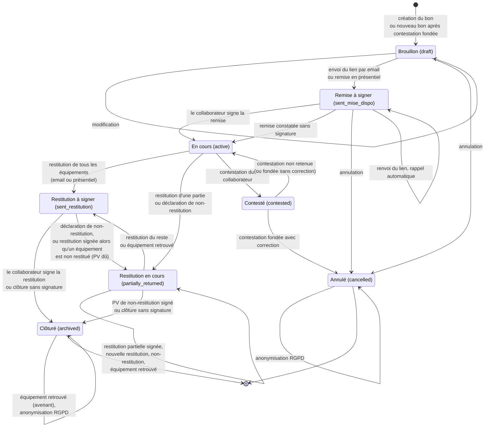

# Architecture de l'application

Document de référence pour le développeur : comment l'application est construite, qui a le droit de faire
quoi, comment un bon passe d'un statut à l'autre, et les pièges déjà rencontrés. Pour démarrer un poste de
développement, lisez d'abord le [README](../README.md). Pour la production, voyez
[deploy/README.md](../deploy/README.md).

Les chiffres donnés ici (modules, modèles, routes) ont été vérifiés dans le code. Le nombre de tests change à
chaque lot : il n'est volontairement pas écrit.

## Sommaire

1. [Vue d'ensemble](#1-vue-densemble)
2. [Vocabulaire](#2-vocabulaire)
3. [Backend](#3-backend)
4. [Frontend](#4-frontend)
5. [Rôles et droits](#5-rôles-et-droits)
6. [Cycle de vie d'un bon](#6-cycle-de-vie-dun-bon)
7. [Carte des routes d'API](#7-carte-des-routes-dapi)
8. [Pièges connus et conventions](#8-pièges-connus-et-conventions)

---

## 1. Vue d'ensemble

L'application remplace les bons papier de **mise à disposition** et de **restitution** du matériel
informatique de toutes les filiales du groupe. Un technicien crée le bon, le signe (signature IT) et envoie
un lien au collaborateur, qui signe en ligne après authentification Microsoft, ou sur place sur l'appareil
du technicien. Chaque étape produit un PDF figé et scellé. La direction consulte les indicateurs et
l'inventaire du parc prêté.

```
Navigateur ──HTTPS──> reverse proxy (Nginx Proxy Manager, TLS)
                          │
                          ▼
               frontend : nginx + application React (port 8080 dans le conteneur)
                 ├── /*      fichiers statiques de l'application
                 └── /api/*  ──> backend NestJS (port 4000, réseau Docker interne)
                                   ├── PostgreSQL 16 (machine séparée en production, TLS)
                                   ├── volume data/ : images de signature et pièces jointes (chiffrées),
                                   │   logos et cachets des filiales
                                   └── services externes : Entra ID (SSO), Active Directory (LDAP/LDAPS),
                                       serveur SMTP, partage SMB, autorité d'horodatage (facultative)
```

L'installation de production (deux machines, stacks Portainer, sauvegardes) est décrite dans
[deploy/README.md](../deploy/README.md).

**Adresse IP du client.** Elle est enregistrée sur chaque signature et dans le journal d'audit, et sert à la
limitation de débit : c'est un élément de preuve. Le reverse proxy pose `X-Real-IP` avec l'adresse de la
connexion, en écrasant la valeur qu'enverrait le poste, **à condition** que le bloc Advanced de son proxy host
contienne `set_real_ip_from 127.0.0.1;`. Sans cette ligne, Nginx Proxy Manager croit l'`X-Real-IP` envoyé par
toute machine d'un réseau privé, et un poste du réseau local choisit l'adresse enregistrée sur ses signatures.
Le nginx du frontend (`frontend/nginx.conf`) retient ensuite, dans cet ordre, `CF-Connecting-IP`
seulement si le conteneur tourne avec `TRUST_CF_CONNECTING_IP=1` (derrière Cloudflare ; `0` par défaut), puis
`X-Real-IP`, puis l'adresse de la connexion, et écrase `X-Real-IP` et `X-Forwarded-For` avec cette même
valeur avant de joindre le backend. Côté backend, la règle commune est `clientIp()`
(`backend/src/common/http/client-ip.ts`) : l'adresse `req.ip` qu'Express tire de `X-Forwarded-For` avec un seul
proxy de confiance, celle que voit aussi le limiteur de débit. Les contrôleurs d'authentification, des bons et
de signature lisent encore `X-Real-IP` directement, jusqu'à leur reprise en vague 3 ; les deux en-têtes portent
la même adresse. Cette chaîne n'est fiable que si le frontend n'est joignable que par le reverse proxy et si
ce dernier est réglé comme indiqué : le bloc Advanced exact et les trois conditions sont dans
[deploy/README.md, « Adresse IP des signataires »](../deploy/README.md#adresse-ip-des-signataires).

### Pile technique

| Couche | Choix |
|---|---|
| Backend | NestJS 12, TypeScript, Node 22 |
| Base de données | PostgreSQL 16, Prisma 5 |
| Frontend | React 18, Vite 6, react-router 7, Tailwind CSS 3 et composants shadcn/ui (Radix), Recharts |
| Authentification | Microsoft Entra ID (`@azure/msal-node`, PKCE), compte local de secours, JWT en cookies httpOnly |
| Annuaire | `ldapjs` (LDAP ou LDAPS) |
| Emails | `nodemailer` (SMTP) |
| PDF | PDFKit, polices DejaVu Sans embarquées |
| Tâches planifiées | `@nestjs/schedule` |
| Limitation de débit | `@nestjs/throttler` |
| Tests | Vitest (backend et frontend), Testing Library, Playwright : voir [testing-guide.md](testing-guide.md) |
| Intégration continue | GitHub Actions (`.github/workflows/docker.yml`), images publiées sur `ghcr.io` |

### Principes structurants

- **La configuration applicative vit en base**, pas dans des variables d'environnement : table `AppConfig`
  (rubrique + clé), secrets chiffrés en AES-256-GCM, modifiables depuis l'écran d'administration sans
  redémarrage. Les rubriques et les clés acceptées sont listées dans `ALLOWED_CONFIG_KEYS`
  (`backend/src/admin/admin.controller.ts`) ; une clé ajoutée là doit avoir un consommateur côté serveur et un
  champ à l'écran. L'environnement ne porte que le strict nécessaire : `ENCRYPTION_KEY`, `JWT_SECRET`,
  `DATABASE_URL`, `FRONTEND_URL`, `DEFAULT_ADMIN_PASSWORD` (facultatif), `NODE_ENV`, et `APP_VERSION` /
  `APP_COMMIT` posés par la construction de l'image.
- **`ENCRYPTION_KEY` ne change jamais.** Elle chiffre les secrets de configuration, les images de signature et
  les pièces jointes. Un canari au démarrage bloque le backend si la clé ne correspond plus aux données.
- **Les documents sont figés.** Chaque PDF produit est stocké en base (`PdfSnapshot`, version courante par
  type) et copié dans une archive probante qui n'est jamais réécrite (`ProofArchive`). Les signatures sont
  scellées par HMAC ; un horodatage RFC 3161 peut s'y ajouter.
- **Le serveur est la seule autorité** sur les droits et sur l'état d'un bon. Le frontend masque ce qui n'est
  pas permis, il ne protège rien.

---

## 2. Vocabulaire

Un objet, un mot, partout : menus, titres, emails, PDF, exports et documentation. Le code garde ses noms
internes, en anglais ou abrégés. Ce tableau est le lexique décidé par le propriétaire ; les écrans l'adoptent au
fil de la refonte. Les libellés vivent à deux endroits qui emploient les mêmes mots :
`frontend/src/domain/labels.ts` pour l'interface (voir [frontend-guide.md](frontend-guide.md)), et, côté
serveur, `backend/src/bons/bon-status.ts` (statuts) et `backend/src/common/category-labels.ts` (catégories)
pour les emails, les PDF et les exports. Changer un mot, c'est changer les deux.

| Notion | Mot retenu | Nom ou valeur dans le code |
|---|---|---|
| Page de gestion des comptes | **Utilisateurs** | `User`, `/admin/utilisateurs` |
| Personne qui reçoit du matériel | **collaborateur** | `collaborateur`, rôle `collaborator` |
| Ligne du catalogue | **article** (menu « Catalogue », onglets Articles et Packs) | `EquipmentCatalog` (un pack : `EquipmentPack`) |
| Objet physique prêté | **équipement** | `BonEquipment` |
| Matériel qui ne revient pas | **non restitué** | `notReturned` |
| Image du tampon de la filiale | **cachet de la filiale** | `Filiale.stampPath` |
| Tracé du technicien | **signature IT** | `Signature.type = it_cachet` |
| Document de perte | **PV de non-restitution** | `pv_cloture`, `cloture_equipements_manquants` |
| Deux retards distincts | **Signature en retard** (bons) et **Retour en retard** (équipements), avec leur seuil | signature : `overdue`, seuil `rappels.signature_overdue_days` ; retour : `returnOverdue`, date de restitution prévue dépassée |
| Issue d'une contestation | **Fondée** / **Non retenue** | `resolved` / `rejected` |

Statuts d'un bon :

| Valeur interne (`BonStatus`) | Libellé retenu | Situation |
|---|---|---|
| `draft` | Brouillon | En préparation, seul statut modifiable aujourd'hui |
| `sent_mise_dispo` | Remise à signer | Lien envoyé (ou présentiel ouvert), signature du collaborateur attendue |
| `active` | En cours | Équipements chez le collaborateur |
| `sent_restitution` | Restitution à signer | Tous les équipements sont marqués rendus, signature attendue |
| `partially_returned` | Restitution en cours | Une partie rendue ou déclarée non restituée ; un sous-état calculé par le serveur précise quoi faire (« PV à signer », « Restitution partielle à signer », « Équipements encore chez le collaborateur », « Perte déclarée ») |
| `archived` | Clôturé | Bon terminé ; la valeur interne `archived` est conservée |
| `cancelled` | Annulé | Abandonné avant signature, ou remplacé après une contestation fondée |
| `contested` | Contesté | Le collaborateur conteste ; en attente de décision de l'IT |

---

## 3. Backend

Le code est rangé par domaine dans `backend/src/<domaine>/`, un module NestJS par domaine. Les tests sont à
côté des sources, dans des dossiers `__tests__/`. Tout ce qui est partagé entre domaines va dans
`backend/src/common/` (tableau ci-dessous). Toutes les routes sont préfixées par `/api`. Les types des réponses
que lit le frontend sont dans `backend/src/contracts/`, recopiés dans `frontend/src/contracts/` par
`npm run sync-contracts` (voir § 7).

### Utilitaires communs

Chaque règle transversale a un seul emplacement. Un service l'importe, il ne la recopie pas.

| Fichier | Contenu |
|---|---|
| `common/dates/paris.ts` | Seule implémentation des dates « à l'heure de Paris ». Fonctions JavaScript : aujourd'hui à Paris, format JJ/MM/AAAA, validation d'une date AAAA-MM-JJ, bornes de jour et de mois, jours écoulés. Fragments `Prisma.sql` équivalents : bornes d'un jour, période, regroupement par jour, semaine ou mois, date du jour |
| `common/csv/` | Fabrication des exports : échappement anti-formule, BOM, assemblage (`buildCsv`). `sendCsv(res, { filename, rows, truncated })` pose `Content-Type`, le nom de fichier daté à Paris, `X-Truncated` et `Access-Control-Expose-Headers` |
| `common/http/client-ip.ts` | Adresse IP du client tracée dans l'audit et les signatures : `req.ip`, celle que voit aussi le limiteur de débit (`trust proxy` = `TRUSTED_PROXY_HOPS`) |
| `common/storage-paths.ts` | Dossiers de `data/` (logos et cachets, signatures, pièces jointes) et `dataPath()`, qui refuse un chemin sortant de `data/` |
| `bons/bon-status.ts` | Ordre, libellés et listes nommées des statuts d'un bon : clôturés, en cours de traitement, à signer, annulables, etc. |
| `common/bon-predicates.ts` | Prédicats métier : signature en retard, parc en circulation, situation d'un équipement |
| `common/category-labels.ts` | Libellés des catégories d'article |
| `common/roles.ts`, `email.ts`, `bon-reference.ts`, `tokens.ts`, `signature-data-url.ts`, `query-utils.ts`, `types.ts` | Rôles IT, adresse email délivrable, numérotation des bons, jetons de signature, contrôle d'une image de signature, lecture d'un entier de requête, types partagés |

### Modules

Dix-neuf modules sont enregistrés dans `AppModule` :

| Module | Dossier | Responsabilité |
|---|---|---|
| `PrismaModule` | `prisma/` | Client Prisma partagé |
| `ConfigModule` | `config/` | Paramètres applicatifs en base, chiffrement des secrets (`EncryptionService`), cache de 5 minutes, secrets masqués en lecture |
| `TemplatesModule` | `templates/` | Les 12 modèles d'email : texte par défaut, personnalisation en base, rendu des variables `{{…}}`, aperçu avec un vrai bon |
| `AuthModule` | `auth/` | SSO Entra ID, compte local et politique de mot de passe, jetons JWT, révocation, gardes `JwtAuthGuard` et `RolesGuard`, rôle recalculé depuis les groupes Entra |
| `AdminModule` | `admin/` | Paramètres par rubrique et leur état, tests de connexion (LDAP, SMTP, Entra, SMB), synchronisation de l'annuaire, rôle d'un utilisateur, déverrouillage, supervision (exports SMB, emails en échec, tâches planifiées), diagnostic SSO, modèles d'email et PDF |
| `LdapModule` | `ldap/` | Synchronisation Active Directory, garde-fou contre une désactivation massive, alerte quand un compte désactivé détient encore des équipements |
| `FilialesModule` | `filiales/` | Filiales : fiche, logo, cachet de la filiale, import et export CSV |
| `EquipmentModule` | `equipment/` | Catalogue (articles et packs), import CSV, historique d'un équipement par n° de série ou d'inventaire, conflits de numéros de série |
| `UsersModule` | `users/` | Recherche d'utilisateurs, comptes manuels (collaborateurs sans compte Active Directory) et leur import/export CSV |
| `NotificationModule` | `notification/` | Envoi SMTP, journal des emails (`NotificationLog`), rappels de signature, rappel avant restitution, alertes à l'IT |
| `SignatureModule` | `signature/` | Liens de signature, signature du collaborateur, signature IT, scellement HMAC, horodatage facultatif, images chiffrées |
| `BonsModule` | `bons/` | Cœur métier : création, envoi, restitution, non-restitution, équipement retrouvé, clôture, annulation, listes, compteurs, export CSV, PDF d'un bon |
| `AuditModule` | `audit/` | Lecture, filtres et export du journal d'audit |
| `ContestationModule` | `contestation/` | Contestations : création par le collaborateur, prise en charge et décision de l'IT |
| `AttachmentsModule` | `attachments/` | Pièces jointes d'un bon, chiffrées sur disque |
| `RetentionModule` | `retention/` | Anonymisation RGPD (plancher de 60 mois, simulation préalable) et purges techniques (liens expirés, journal d'audit, pièces jointes) |
| `ReportingModule` | `reporting/` | Inventaire du parc prêté : liste, résumé, regroupement par collaborateur, export. Le nom du dossier est historique |
| `KpiModule` | `kpi/` | Indicateurs du tableau de bord (Parc, Délais, Incidents), cache de 60 secondes |
| `MonitoringModule` | `monitoring/` | Suivi des tâches planifiées (`ScheduledJobRun`), sonde de la base, version et commit déployés |

Deux modules sont importés par d'autres plutôt que par `AppModule` : `PdfModule` (`pdf/` : génération PDFKit,
modèles PDF personnalisables, instantanés et archive probante, régénération des PDF manquants) et `SmbModule`
(`smb/` : copie des PDF sur un partage réseau monté, suivi et relance). `health.controller.ts` expose les
sondes `/api/health` (le processus répond) et `/api/health/ready` (la base répond, sinon `503`).

### Organisation du module des bons

`BonsService` est une façade. Le travail est fait par des fonctions à dépendances explicites :

- `bons/workflow/` : une étape par fichier (`bon-crud`, `bon-send` pour l'email et le présentiel,
  `bon-restitution`, `bon-mark-found`, `bon-cloture` pour le PV et la clôture sans signature, `bon-resend`),
  avec leurs dépendances regroupées dans `bon-context.ts` ;
- `bons/queries/` : filtres de liste, tri, projection allégée, compteurs de l'accueil ;
- `bons/validation/` : filiale et collaborateur actifs, catalogue, numéros de série en double dans un même
  bon, possibilité d'envoi. Un numéro déjà en circulation sur un autre bon se cherche avec
  `findSerialConflicts` (`equipment/equipment-serial.ts`), la même fonction que l'écran de saisie ;
- `bons/bon-status.ts` : ordre, libellés et listes nommées des statuts ;
- `bons/export/` : export CSV.

`signature/` et `bons/` dépendent l'un de l'autre. Le cycle est cassé par le jeton `BONS_SERVICE`
(`bons/bons.tokens.ts`), résolu par `ModuleRef` : n'importez jamais `BonsService` directement depuis
`signature/`.

### Données

`backend/prisma/schema.prisma` décrit **18 modèles** et **11 énumérations**.

| Groupe | Modèles |
|---|---|
| Référentiels | `User`, `Filiale`, `EquipmentCatalog`, `EquipmentPack`, `EquipmentPackItem`, `AppConfig` |
| Bons | `Bon`, `BonEquipment`, `Signature`, `Contestation`, `Attachment` |
| Preuve | `PdfSnapshot` (version courante d'un document), `ProofArchive` (copie jamais réécrite) |
| Suivi | `NotificationLog`, `SmbExport`, `AuditLog`, `ScheduledJobRun`, `RevokedToken` |

Énumérations : `UserRole`, `BonStatus`, `Civilite`, `EquipmentCategory`, `SignatureType`, `PdfSnapshotType`,
`SmbExportStatus`, `ContestationStatus`, `NotificationType`, `NotificationStatus`, `ScheduledJobStatus`.
L'ordre des valeurs de `BonStatus` en base diffère de celui du schéma : ne triez jamais sur cet ordre (voir
§ 8).

Les migrations sont dans `backend/prisma/migrations/`. Le backend de production les applique au démarrage
(`prisma migrate deploy`). La CI rejoue toutes les migrations sur une base neuve et échoue si
`schema.prisma` a changé sans migration.

### Tâches planifiées

Toutes sont déclarées dans le registre `backend/src/monitoring/job-registry.ts`, suivies dans
`ScheduledJobRun` et visibles côté administration.

| Tâche | Quand (heure de Paris) | Effet |
|---|---|---|
| Synchronisation de l'annuaire | toutes les 6 h ; un intervalle plus long se règle (`ldap.sync_interval_hours`) | Comptes créés, mis à jour ou désactivés ; alerte de départ |
| Rappels de signature | jours ouvrés, 9 h | Relance des signatures en attente |
| Rappel avant restitution | tous les jours, 9 h | Prévient le collaborateur avant la date de restitution prévue |
| Rétention RGPD | dimanche, 3 h | Anonymisation et purges techniques |
| Relance des exports SMB | toutes les 6 h | Nouvelle tentative des copies en échec, trois relances au plus par copie |

Aucune tâche planifiée ne change le statut d'un bon.

### Modèles d'email et de PDF

Douze modèles d'email, définis dans `backend/src/templates/template-catalog.ts` : `mise_disposition_request`,
`restitution_request`, `pv_cloture_request`, `confirmation_mise_disposition`, `confirmation_restitution`,
`confirmation_pv_cloture`, `reminder`, `restitution_due_reminder`, `contestation_alert`,
`contestation_resolved`, `contestation_rejected`, `departure_alert`. Le texte par défaut est dans
`templates/defaults/` ; une personnalisation est enregistrée dans `AppConfig` (rubrique `email_templates`) et
peut être réinitialisée.

Quatre modèles de PDF (`backend/src/pdf/pdf-template-definitions.ts`) : `mise_disposition`,
`restitution`, `cloture` (PV de non-restitution) et `avenant` (équipement retrouvé après clôture). Leur mise
en forme (couleurs, polices, marges, textes, sections affichées) est un JSON validé ; seules les valeurs
modifiées sont stockées (`AppConfig`, rubrique `pdf_templates`).

### Journal d'audit

Chaque action significative écrit une ligne `AuditLog` : action en `snake_case` préfixée par l'entité
(`bon_`, `signed_`, `login_`, `contestation_`…), auteur, bon concerné, adresse IP, agent utilisateur et
détails en JSON. Toute nouvelle action reçoit son libellé dans
`frontend/src/pages/admin/audit-logs/actionMeta.ts`. Aujourd'hui, chaque module écrit directement dans la
table ; un service d'audit unique avec un catalogue d'actions est prévu (vague 3), ainsi que la trace des
changements de paramètres (sans secret) et des filiales.

---

## 4. Frontend

`frontend/src/` est organisé ainsi :

| Dossier | Contenu |
|---|---|
| `pages/` | Un dossier par écran ou domaine (`bons/`, `dashboard/`, `inventaire/`, `materiel/`, `portail/`, `signature/`, `admin/…`), avec ses composants, ses hooks et sa logique pure testée |
| `components/ui/` | Composants shadcn/ui (Radix + Tailwind) |
| `components/layout/` | Coque de l'application : menu latéral, en-tête, recherche globale, fil d'Ariane, sous-menu d'administration |
| `components/dashboard/` | Tuiles et graphiques partagés par le tableau de bord |
| `components/list/` | Briques communes des listes : pagination 25 / 50 / 100, en-tête de colonne triable, états chargement / vide / erreur, bascule du tableau en cartes sur téléphone |
| `hooks/` | Hooks transverses. Listes : `useUrlFilters` (filtres dans l'adresse), `usePagination`, `useSort`, `useDebounce` ; `useDownload` (téléchargement), `usePageTitle` (titre d'onglet) ; et aussi chargement d'une ressource, filiales actives, canevas de signature, notifications, saisie non enregistrée |
| `lib/` | Client HTTP (`api.ts` : cookies, en-tête anti-CSRF, rafraîchissement du jeton), rôles, emails, dates, formats, validation |
| `domain/` | `labels.ts`, le lexique : chaque libellé métier affiché à l'écran (voir § 2) |
| `contracts/` | Types des réponses de l'API, **copie générée** de `backend/src/contracts/` : on modifie la source côté backend puis on relance `npm run sync-contracts` ; la CI échoue si la copie n'est pas à jour |
| `contexts/` | Session (`AuthContext`), thème clair ou sombre, vue d'interface |
| `types/` | Types partagés |
| `test/` | `render.tsx` (rendu avec routeur), `url-hook.tsx` (hook qui lit ou écrit l'adresse) et `setup.ts` (configuration de Vitest) |

Les conventions du frontend (appels d'API, listes, dates, libellés, formulaires, retours à l'utilisateur,
accessibilité, mobile) sont dans [frontend-guide.md](frontend-guide.md).

### Écrans et adresses (état actuel)

| Adresse | Écran | Rôles |
|---|---|---|
| `/login`, `/change-password` | Connexion (SSO ou compte local), changement de mot de passe | public, puis compte connecté |
| `/signer/:token` | Signature d'un document par le collaborateur | lien reçu par email : le collaborateur se connecte (Microsoft) ; en présentiel, la session du technicien suffit. **Adresse figée** : elle figure dans des emails déjà envoyés |
| `/dashboard` | Tableau de bord à onglets : Aujourd'hui, Parc, Délais, Incidents | IT, `direction` (sans « Aujourd'hui ») |
| `/bons`, `/bons/new`, `/bons/:id`, `/bons/:id/edit` | Liste, création, fiche et modification d'un bon | IT |
| `/inventaire` | Parc prêté, par équipement ou par collaborateur | IT, `direction` |
| `/materiel/:reference` | Historique d'un équipement (n° de série ou d'inventaire) | IT, `direction` (sans lien vers les bons) |
| `/mes-bons`, `/mes-bons/:id` | Portail du collaborateur | compte connecté |
| `/admin/contestations`, `/admin/catalogue` | Contestations, catalogue | IT |
| `/admin/utilisateurs`, `/admin/filiales` | Utilisateurs, filiales | `admin` |
| `/admin/configuration/*` | Paramètres : `general`, `ldap`, `entra`, `smtp`, `rappels`, `tokens`, `smb`, `timestamp`, `retention`, `monitoring` | `admin` |
| `/admin/templates/email`, `/admin/templates/pdf` | Modèles d'email et de PDF | `admin` |
| `/admin/ldap-sync`, `/admin/audit` | Synchronisation de l'annuaire, journal d'audit | `admin` |

« IT » désigne les rôles `admin` et `technician`. Une adresse refusée au rôle mène à la page 403
(`/unauthorized`, « Vous n'avez pas accès à cette page »), une adresse inconnue à « Page introuvable ». Les
anciennes adresses `/admin/reports`, `/admin/ldap`, `/admin/email-templates` et `/admin/pdf-templates`
redirigent vers les nouvelles.

Aujourd'hui, le menu latéral de l'administrateur compte trois groupes (Opérations, Référentiel,
Administration) ; celui du technicien n'a que les deux premiers, sans Utilisateurs ni Filiales. La direction
voit Tableau de bord et Inventaire, le collaborateur Mes bons. Un sélecteur de vue permet à un membre de l'IT
de voir l'interface d'un autre rôle. **Cible décidée** (vague 4) : menu
Suivi (Accueil `/accueil`, Bons, Inventaire, Contestations), Référentiels (Utilisateurs `/utilisateurs`,
Filiales `/filiales`, Catalogue `/catalogue`) et Administration (Paramètres, Modèles, Supervision, Journal
d'audit), des adresses en français avec redirection de toutes les anciennes, la suppression du sélecteur de
vue, et « Mes équipements » (`/mes-equipements`) pour chacun en bas du menu. `/signer/:token` ne change pas.

---

## 5. Rôles et droits

### Les quatre rôles

| Rôle (`UserRole`) | Qui |
|---|---|
| `admin` | Administrateurs de l'application |
| `technician` | Techniciens de l'équipe IT |
| `direction` | Direction : lecture des indicateurs et de l'inventaire |
| `collaborator` | Tout autre compte : reçoit des équipements, signe, conteste |

`admin` et `technician` forment le personnel IT (`isItRole()` dans `backend/src/common/roles.ts`, miroir
d'affichage dans `frontend/src/lib/roles.ts`).

### Attribution

- **Connexion Microsoft** : le rôle est recalculé à **chaque** connexion depuis les groupes Entra présents dans
  le jeton (`backend/src/auth/role-mapping.ts`). Priorité `admin` > `technician` > `direction` >
  `collaborator`. Les identifiants de groupe se règlent dans les paramètres Entra ID. Il faut, côté Entra, une
  revendication de groupes (groupes de sécurité, identifiant de groupe, jeton d'identité) ; sans elle, le rôle
  enregistré est conservé et le diagnostic SSO de l'écran d'administration l'indique.
- **Compte local** : `admin@local`, créé au premier démarrage. Son mot de passe vient de
  `DEFAULT_ADMIN_PASSWORD`, sinon il est tiré au hasard et écrit dans `data/initial-admin-password.txt`
  (supprimé au premier changement de mot de passe, obligatoire). Un administrateur peut changer le rôle d'un
  compte local ; pour un compte Microsoft, les groupes l'emportent à la connexion suivante.
- **Comptes manuels** : collaborateurs sans compte Active Directory, créés à la main, avec ou sans adresse. Ils
  ne peuvent pas se connecter et la synchronisation de l'annuaire ne les touche jamais. Sans adresse, leurs
  documents se signent en présentiel.

### Session

Deux cookies httpOnly : le jeton d'accès (15 minutes, limité à `/api`) et le jeton de rafraîchissement
(8 heures, limité à `/api/auth`), révocable. Toute requête qui modifie quelque chose porte l'en-tête
`X-Requested-With` (protection CSRF, posée par `frontend/src/lib/api.ts`). Un compte local est verrouillé
30 minutes après une série d'échecs. Un compte qui doit changer son mot de passe n'accède à rien d'autre.
Le détail et les règles à respecter sont dans [security.md](security.md).

### Qui peut faire quoi

Décision du propriétaire : le technicien gère le **Catalogue**, mais plus les Utilisateurs ni les Filiales.

| Domaine | `admin` | `technician` | `direction` | `collaborator` |
|---|---|---|---|---|
| Bons : créer, envoyer, restituer, clôturer, annuler | oui | oui | non | non |
| Contestations : prendre en charge, décider | oui | oui | non | non |
| **Ses propres** bons : consulter, PDF, pièces jointes, signer, contester | oui | oui | oui | oui |
| Tableau de bord | oui | oui | oui, sans l'onglet « Aujourd'hui » | non |
| Inventaire, historique d'un équipement | oui | oui | lecture, sans lien vers les bons | non |
| Catalogue (articles et packs) : lire et modifier | oui | oui | non | non |
| Recherche du destinataire d'un bon, fiche d'une personne en lecture, liste des comptes IT (filtre « Créé par ») | oui | oui | non | non |
| Gestion des utilisateurs : liste de l'écran Utilisateurs, comptes manuels (y compris depuis le formulaire de bon), import et export, rôle, déverrouillage | oui | non | non | non |
| Gestion des filiales : liste complète, création, modification, logo, cachet, suppression, import et export | oui | non | non | non |
| Liste des filiales actives, pour les formulaires et les filtres | oui | oui | oui | non |
| Synchronisation de l'annuaire | oui | non | non | non |
| Paramètres, modèles d'email et de PDF (lecture comprise), supervision, journal d'audit, rétention | oui | non | non | non |

Le serveur fait foi : chaque route déclare ses rôles, et une route non déclarée est refusée, même à un
administrateur (voir § 7). Sur une route ouverte à tout compte connecté, un compte non IT n'atteint que ses
propres bons (`verifyCollaboratorAccess`, `backend/src/bons/bons-access.ts`) ; la direction y a accès comme
tout le monde, puisqu'elle peut aussi recevoir des équipements. Le chemin du cachet d'une filiale n'est jamais
renvoyé à un compte non IT. L'interface suit ces droits : le technicien ne voit ni Utilisateurs ni Filiales
dans le menu, et leurs adresses le mènent à la page 403. Le modèle d'accès complet, avec la marche à suivre
pour ajouter une route, est dans [security.md, « Modèle d'accès »](security.md).

---

## 6. Cycle de vie d'un bon

### Statuts et transitions (état actuel)

Les états portent le libellé retenu et, entre parenthèses, la valeur interne.



Règles appliquées par le code aujourd'hui :

- Chaque transition vérifie le statut de départ dans la même transaction que la mise à jour et répond `409`
  si le bon a changé entre-temps.
- L'annulation n'est possible que depuis Brouillon ou Remise à signer.
- Le PV de non-restitution est émis quand plus aucun équipement n'attend sa restitution et qu'au moins un est
  déclaré non restitué. Cet état se calcule à partir des équipements (`emitPvClotureIfDue`,
  `bons/workflow/bon-cloture.ts`), jamais d'un indicateur séparé ; l'émission est idempotente.
- « Équipement retrouvé » ne clôture jamais un bon tant qu'un équipement reste à traiter ; sur un bon déjà
  clôturé, il produit un avenant.
- Le même geste « clôture sans signature » (`close-unilateral`) constate la remise quand le bon attend la
  signature de remise, et clôture le bon sinon.

### Documents et signatures

| Étape | Signature (`Signature.type`) | Document PDF (`PdfSnapshotType`) | Emails au collaborateur |
|---|---|---|---|
| Signature IT de la remise | `it_cachet`, `pdfType` `mise_disposition` | `signature_it_mise_disposition` | |
| Remise signée par le collaborateur (email ou présentiel) | `mise_disposition` | `signature_collab_mise_disposition` | demande, rappels, confirmation |
| Signature IT de la restitution | `it_cachet`, `pdfType` `restitution` | `signature_it_restitution` | |
| Restitution signée, totale ou partielle | `restitution` | `signature_collab_restitution`, réécrit à chaque restitution partielle, copie gardée dans `ProofArchive` | demande, rappels, confirmation |
| Signature IT du PV de non-restitution | `it_cachet`, sans `pdfType` | `cloture_equipements_manquants` | |
| PV de non-restitution signé (email uniquement) | `pv_cloture` | `cloture_equipements_manquants` | demande, rappels, confirmation |
| Clôture sans signature | aucune, motif obligatoire | réutilise le document de l'étape, suffixe `_cloture_unilaterale` dans le nom du fichier | avis de clôture sans signature |
| Équipement retrouvé après clôture | `it_cachet` | `avenant_equipement_retrouve` | avis d'équipement retrouvé |

Autres emails : annulation d'un bon déjà envoyé, réponse à une contestation, rappel avant la date de
restitution prévue. L'IT reçoit une alerte à chaque contestation et quand un compte désactivé détient encore
des équipements.

Un lien de signature envoyé par email exige une connexion Microsoft du collaborateur concerné. Un lien
présentiel est valable 2 heures et s'ouvre sur l'appareil du technicien, qui est tracé comme mandataire.

### Évolutions décidées (vague 2)

Le propriétaire a tranché les points suivants ; le diagramme ci-dessus sera mis à jour avec le code.

- Une **machine à états unique** côté serveur (statut, actions permises, statut suivant) et un **sous-état**
  calculé pour « Restitution en cours ».
- Rappels : **3 par document** (remise, restitution, PV), compteur remis à zéro à chaque nouvelle demande.
- PDF : la case IT porte le technicien qui a réellement signé ce document ; la case du collaborateur, la
  signature et la date de ce document.
- Un bon envoyé mais non signé devient **modifiable** : la modification invalide le lien, exige une nouvelle
  signature IT et renvoie un lien, avec une trace dans le journal d'audit.
- Annulation d'un bon envoyé : tout technicien, **motif obligatoire**, email au collaborateur.
- Deux actions distinctes : « **Constater la remise sans signature** » (vers En cours) et « **Clôturer sans
  signature** » (vers Clôturé).
- Compte désactivé (départ) : plus aucun lien ni rappel ; restitution en présentiel, sinon clôture sans
  signature avec motif.
- Présentiel : restitution partielle au guichet et PV de non-restitution signable sur place.
- Un marquage « rendu » erroné s'annule tant que le collaborateur n'a pas signé.
- Contestation possible aussi sur une restitution et sur un PV. **Fondée** : un nouveau bon est envoyé,
  l'original reste En cours jusqu'à la signature du nouveau, puis il est clôturé comme remplacé. **Non
  retenue** : rien ne change. La voie « fondée sans correction » disparaît. L'IT est relancée si une
  contestation n'est pas traitée sous 7 jours.
- Un collaborateur qui change de filiale garde ses bons sur la filiale d'origine ; la création d'un bon
  avertit si la filiale diffère de celle du collaborateur.

---

## 7. Carte des routes d'API

État du code à la fin de la vague 1, avant la vague 3. **La vague 3 fait évoluer cette carte** : enveloppe de
liste unique `{ items, total, page, limit, truncated }`, format d'erreur unique, pagination bornée, verbes
explicites (par exemple `POST /bons/:id/cancel`), routes regroupées par domaine. Les anciens chemins y restent
servis comme alias dépréciés et journalisés.

Deux sources font foi et sont vérifiées par des tests : la table exhaustive route par route,
`backend/src/auth/__tests__/__snapshots__/route-access.md`, régénérée par `route-access.spec.ts`, et la forme
des réponses, décrite par les types partagés et les tests de contrat HTTP (voir
[testing-guide.md](testing-guide.md)). Les tableaux ci-dessous regroupent les routes par domaine pour la
lecture. Les paramètres qu'accepte une route (filtres, tri, pagination, corps) se lisent dans ses DTO
(`backend/src/<domaine>/dto/`, par exemple `bons/dto/query-bons.dto.ts`), la forme de ses réponses dans
`backend/src/contracts/`.

Chaque route déclare qui peut l'appeler : `@Roles(...)`, ou `@Public()` pour les rares routes ouvertes sans
session. `RolesGuard` **refuse par défaut** une route qui n'a ni l'un ni l'autre.

Légende : **IT** = `admin` + `technician` ; **tous** = tout compte connecté, quel que soit son rôle (hors IT,
l'accès à un bon est limité à ses propres bons) ; **public** = sans session. Toutes les routes commencent par
`/api`. La limite de débit globale est de 60 requêtes par minute et par adresse ; la colonne « Limite » donne
les exceptions.

### Authentification (`/api/auth`)

| Verbe | Route | Rôles | Limite | Remarque |
|---|---|---|---|---|
| GET | `/auth/login` | public | | Redirection vers Microsoft (PKCE) |
| GET | `/auth/callback` | public | | Retour de Microsoft, pose les cookies |
| POST | `/auth/refresh` | public | 20/min par utilisateur | Cookie de rafraîchissement requis |
| POST | `/auth/logout` | tous | 10/min | |
| GET | `/auth/me` | tous | | Utilisateur courant |
| GET | `/auth/setup-required` | public | | |
| POST | `/auth/local-login` | public | 5/min | Compte local |
| POST | `/auth/change-password` | tous | 5/min | |
| GET | `/auth/local-auth-status` | public | | Compte local activé ou non |

### Bons (`/api/bons`)

| Verbe | Route | Rôles | Limite | Remarque |
|---|---|---|---|---|
| GET | `/bons` | IT | | Liste paginée, projection allégée. Filtres `status`, `excludeStatus`, `filialeId`, `search`, `overdue`, `dateFrom` / `dateTo`, `noReturnDate`, `createdById`, `ids` ; tri `sort` et `order` (une valeur inconnue répond `400`) |
| GET | `/bons/stats` | IT | | Compteurs de l'onglet Aujourd'hui, avec le seuil de retard appliqué |
| GET | `/bons/recent` | IT | | |
| GET | `/bons/export` | IT | | CSV, mêmes filtres et tri que la liste ; `ids` pour une sélection de 100 bons au plus |
| GET | `/bons/mes-bons` | tous | | Bons de l'utilisateur connecté |
| GET | `/bons/:id` | tous | | Fiche complète |
| GET | `/bons/:id/notifications` | IT | | Historique des emails du bon |
| GET | `/bons/:id/integrity` | tous | | Vérification des sceaux |
| GET | `/bons/:id/pdf` | tous | | Document PDF d'une étape |
| GET | `/bons/:id/pdf-snapshots` | tous | | Documents disponibles |
| GET | `/bons/:id/pdf-snapshots/missing` | IT | | Documents attendus mais absents |
| POST | `/bons` | IT | | Création (depuis le catalogue, un pack ou en saisie libre) |
| PUT | `/bons/:id` | IT | | Modification d'un brouillon |
| DELETE | `/bons/:id` | IT | | Annulation |
| POST | `/bons/:id/sign-it` | IT | 10/min | Signature IT |
| POST | `/bons/:id/send` | IT | | Envoi du lien de remise ; `409` si un n° de série est déjà prêté, sauf confirmation |
| POST | `/bons/:id/initiate-inperson` | IT | | Lien présentiel (remise ou restitution), valable 2 h |
| POST | `/bons/:id/initiate-restitution` | IT | | Restitution de tout ou partie des équipements |
| POST | `/bons/:id/declare-not-returned` | IT | | Déclaration de non-restitution |
| POST | `/bons/:id/mark-found` | IT | | Équipement retrouvé |
| POST | `/bons/:id/close-unilateral` | IT | | Remise constatée ou clôture sans signature, motif obligatoire |
| POST | `/bons/:id/resend` | IT | 5/min | Renvoi du lien en attente |
| POST | `/bons/resend-batch` | IT | 10/min | Renvoi groupé, 10 bons au plus |
| POST | `/bons/:id/contestation` | tous | | Contestation par le collaborateur du bon |
| GET, POST | `/bons/:bonId/attachments` | tous | | Pièces jointes : liste, dépôt |
| GET, DELETE | `/bons/:bonId/attachments/:attachmentId` | tous | | Pièce jointe : téléchargement, suppression |

### Signature (`/api/signature`)

| Verbe | Route | Rôles | Limite | Remarque |
|---|---|---|---|---|
| GET | `/signature/:token` | tous | | Informations du document à signer |
| GET | `/signature/:token/preview` | tous | 10/min | Aperçu du PDF |
| POST | `/signature/:token/sign` | tous | 10/min | Signature ; le signataire doit être le collaborateur du bon, sauf en présentiel |

### Contestations (`/api/contestations`)

| Verbe | Route | Rôles | Remarque |
|---|---|---|---|
| GET | `/contestations` | IT | Liste, avec le nombre de contestations ouvertes |
| PATCH | `/contestations/:id/review` | IT | Prise en charge |
| PATCH | `/contestations/:id/resolve` | IT | Décision |

### Inventaire et indicateurs

| Verbe | Route | Rôles | Remarque |
|---|---|---|---|
| GET | `/reporting/inventory` | IT, `direction` | Parc prêté, filtré, trié, paginé |
| GET | `/reporting/inventory/summary` | IT, `direction` | Répartition par catégorie et par filiale |
| GET | `/reporting/inventory/by-collaborateur` | IT, `direction` | Une ligne par personne, plafonnée (champ `truncated` et en-tête `X-Truncated`) |
| GET | `/reporting/inventory/export` | IT, `direction` | CSV |
| GET | `/kpi/parc`, `/kpi/delais`, `/kpi/incidents` | IT, `direction` | Onglets du tableau de bord ; `from`, `to` (AAAA-MM-JJ, Paris), `filialeId` ; cache de 60 s |

### Catalogue et équipements (`/api/equipment`)

| Verbe | Route | Rôles | Remarque |
|---|---|---|---|
| GET | `/equipment/history`, `/equipment/history/export` | IT, `direction` | Historique d'un équipement par n° de série ou d'inventaire, et son CSV |
| GET | `/equipment/serial-history` | IT | Alias déprécié de `/equipment/history` |
| GET | `/equipment/serial-conflicts` | IT | Numéros de série déjà prêtés sur un autre bon |
| GET | `/equipment/catalog`, `/catalog/active`, `/catalog/search`, `/catalog/:id` | IT | Articles |
| POST, PUT, DELETE | `/equipment/catalog`, `/catalog/:id` | IT | Création, modification, désactivation d'un article |
| POST | `/equipment/catalog/import` | IT | Import CSV |
| GET | `/equipment/packs`, `/packs/active`, `/packs/:id` | IT | Packs |
| POST, PUT, DELETE | `/equipment/packs`, `/packs/:id` | IT | Création, modification, désactivation d'un pack |

### Utilisateurs (`/api/users`)

| Verbe | Route | Rôles | Remarque |
|---|---|---|---|
| GET | `/users/search` | IT | Recherche d'un collaborateur pour le formulaire de bon |
| GET | `/users/:id` | IT | Fiche d'un utilisateur, en lecture |
| GET | `/users/it-staff` | IT | Comptes IT, pour le filtre « Créé par » de la liste des bons |
| GET | `/users` | `admin` | Écran Utilisateurs : liste, paginée si `page` est fourni |
| POST | `/users/manual` | `admin` | Création d'un compte manuel, y compris depuis le formulaire de bon |
| PATCH | `/users/:id/manual` | `admin` | Modification d'un compte manuel |
| GET | `/users/manual/export`, `/users/manual/import/template` | `admin` | CSV des comptes manuels, modèle d'import |
| POST | `/users/manual/import` | `admin` | Import CSV, 500 lignes au plus |

### Filiales (`/api/filiales`)

| Verbe | Route | Rôles | Limite | Remarque |
|---|---|---|---|---|
| GET | `/filiales/active` | IT, `direction` | | Filiales actives, réduites à `{ id, name, displayName, active }`, pour les formulaires et les filtres |
| GET | `/filiales`, `/filiales/:id` | `admin` | | |
| POST, PUT, DELETE | `/filiales`, `/filiales/:id` | `admin` | | Création, modification, suppression |
| PATCH | `/filiales/:id/logo`, `/filiales/:id/stamp` | `admin` | 5/min | Dépôt du logo, du cachet de la filiale : PNG ou JPEG seulement, reconnus à leurs octets, les seuls formats que PDFKit dessine |
| GET | `/filiales/export`, `/filiales/import/template` | `admin` | | CSV (`images=1` pour y joindre logo et cachet), modèle d'import |
| POST | `/filiales/import` | `admin` | | Import CSV, 200 lignes au plus |

Aucune route ne sert les fichiers déposés (logos, cachets) : un cachet ne quitte le serveur qu'imprimé sur un
PDF.

### Administration (`/api/admin`)

Toutes les routes de ce préfixe sont réservées à `admin`.

| Verbe | Route | Limite | Remarque |
|---|---|---|---|
| GET, PUT | `/admin/config/:category` | | Paramètres d'une rubrique, secrets masqués en lecture |
| GET | `/admin/config/health` | | État de chaque rubrique, sans aucun secret |
| POST | `/admin/config/test/ldap`, `/test/smtp`, `/test/entra`, `/test/smb` | | Tests de connexion |
| GET | `/admin/ldap/status` | | État de la dernière synchronisation |
| POST | `/admin/ldap/sync` | | Synchronisation immédiate |
| DELETE | `/admin/ldap/users` | | Désactivation des comptes de l'annuaire |
| PATCH | `/admin/users/:id/role` | | Refusé sur soi-même et sur le dernier administrateur actif |
| POST | `/admin/users/:id/unlock` | | Déverrouillage d'un compte local |
| GET | `/admin/status` | | Version, base, tâches planifiées |
| GET | `/admin/sso/diagnostic` | | Dernières connexions Microsoft et rôle attribué |
| GET | `/admin/notifications/failed` | | Emails en échec |
| GET | `/admin/smb/status`, `/admin/smb/failed` | | Suivi des exports SMB |
| POST | `/admin/smb/retry/:id`, `/admin/smb/retry-all` | | Relance |
| POST | `/admin/pdf/regenerate-missing` | | Régénération des PDF manquants |
| GET | `/admin/retention/preview`, `/admin/retention/stats` | | Simulation, volumes purgeables |
| POST | `/admin/retention/run`, `/admin/retention/purge` | | Anonymisation, purge technique |
| GET | `/admin/email-templates`, `/export`, `/:id/html`, `/:id/preview` | | Modèles d'email |
| GET | `/admin/email-templates/preview-bons`, `/admin/email-templates/:id/preview-bon/:bonId` | | Choix d'un vrai bon, aperçu du modèle avec ce bon |
| PATCH, DELETE | `/admin/email-templates/:id` | | Personnalisation, retour au texte par défaut |
| POST | `/admin/email-templates/import`, `/admin/email-templates/:id/test`, `/admin/email-templates/:id/test-bon` | | Import, email de test (données d'exemple ou vrai bon) |
| GET | `/admin/pdf-templates`, `/export`, `/:id/config` | | Modèles de PDF |
| GET | `/admin/pdf-templates/:id/preview` | 10/min | Aperçu PDF |
| PATCH, DELETE, POST | `/admin/pdf-templates/:id`, `/admin/pdf-templates/import` | | Personnalisation, réinitialisation, import |

### Journal d'audit et sondes

| Verbe | Route | Rôles | Remarque |
|---|---|---|---|
| GET | `/audit`, `/audit/actions`, `/audit/export` | `admin` | Journal filtré, liste des actions, CSV |
| GET | `/health` | public | Le processus répond |
| GET | `/health/ready` | public | La base répond, sinon `503` |

---

## 8. Pièges connus et conventions

Chacun de ces points a déjà causé un défaut réel, ou justifie un choix qu'il ne faut pas défaire sans raison.

### Choix délibérés

| Choix | Raison |
|---|---|
| Signature tracée dans un canevas HTML natif (`frontend/src/hooks/use-signature-canvas.ts`), sans bibliothèque | Les bibliothèques testées cassaient sous le double rendu de React 18 en mode strict. Le tracé est fin à l'écran, puis rejoué épais et noir hors écran pour le PDF |
| PDF stockés en base (`Bytes`), pas sur disque | Aucun décalage possible entre fichier et base ; sauvegarder la base sauvegarde les documents |
| Configuration chiffrée en base, pas dans l'environnement | Modifiable sans redémarrage, depuis l'écran d'administration |
| Signature IT posée au moment de l'action (envoi, restitution, PV) | Le technicien signe ce qu'il remet ou reprend réellement |
| `pdfType` explicite lors d'une signature IT | Le statut du bon ne suffit pas à dire quel document est signé |
| Les CSV se fabriquent avec `backend/src/common/csv/` : BOM UTF-8, séparateur `;`, cellules entre guillemets, formules neutralisées | Ouverture directe dans Excel en français, sans qu'une cellule puisse s'exécuter comme une formule |
| Filtres, tri et onglets portés par l'adresse | Un lien partagé ou un retour arrière rouvre le même écran |

### SQL brut (`$queryRaw`)

- **Toujours `Prisma.sql`**, jamais de concaténation de chaînes.
- **Colonnes d'énumération : `::text`.** Comparer `b.status` à un paramètre texte échoue (`operator does not
  exist: "BonStatus" = text`). Castez la colonne : `b.status::text IN (...)`.
- **`AVG`, `EXTRACT(EPOCH …)`, `percentile_cont` : `::float8`**, sinon Prisma renvoie un `Decimal`.
- **`COUNT(*)` renvoie un `bigint`** (`5n`), que `JSON.stringify` refuse. Écrivez `COUNT(*)::bigint` et
  convertissez avec `Number()` avant de répondre.
- Les tests d'un service SQL vérifient le texte généré (présence des casts), et les suites `real-db` exécutent
  les requêtes contre une vraie base : voir [testing-guide.md](testing-guide.md).

### Fuseau horaire

- Les dates sont stockées en `timestamp` **sans fuseau, en UTC**. La base de développement et celle de la CI
  tournent en `TZ=UTC` : ne changez pas ce réglage.
- N'écrivez jamais `colonne AT TIME ZONE 'Europe/Paris'` directement sur une colonne Prisma : Postgres relit
  les chiffres UTC comme une heure de Paris et décale d'une ou deux heures.
- Toute date « à l'heure de Paris » passe par `backend/src/common/dates/paris.ts`, l'unique implémentation :
  fonctions JavaScript et fragments `Prisma.sql` équivalents (début de jour de Paris ramené en UTC, période,
  regroupement par jour, semaine ou mois). Aucun calcul ne dépend du fuseau de la machine : le poste de
  développement est à l'heure de Paris, les conteneurs en UTC.
- Les jours civils affichés, filtrés ou exportés sont ceux de **Paris** (période du tableau de bord, filtres
  du journal d'audit, dates des CSV). Une tâche planifiée à heure fixe (rappels à 9 h, rétention le dimanche
  à 3 h) déclare `timeZone: 'Europe/Paris'`.

### Migrations Prisma

- **Additives d'abord**, et **idempotentes** (`IF NOT EXISTS`, `IF EXISTS`) : la production est en service.
- **`ALTER TYPE … ADD VALUE` seul dans sa migration.** Postgres interdit d'utiliser une valeur d'énumération
  dans la transaction qui l'a créée. Exemple : `20260916110000_user_role_direction`.
- Une contrainte d'unicité posée sur des données existantes vérifie d'abord les doublons et échoue avec leur
  liste (exemple : `20260916100400_unique_constraints`).
- L'ordre des valeurs de `BonStatus` en base n'est pas celui du schéma : un tri par statut suit l'ordre
  métier, écrit explicitement.

### Règles métier partagées

- **Un seul prédicat par notion.** « Signature en retard », « équipement prêté », « situation d'un
  équipement » : utilisez `backend/src/common/bon-predicates.ts`, ne les recalculez pas. Trois définitions
  divergentes du retard ont coexisté avant cette règle.
- **L'état métier se déduit des champs métier** (`BonEquipment.returnedAt`, `notReturned`), jamais de
  l'existence d'une ligne `Signature` : la rétention purge les liens expirés.
- La signature IT se pose aussi sur un brouillon (le bouton « Envoyer » signe puis envoie). Seuls les bons
  annulés, clôturés ou contestés la refusent.
- Les actions d'audit `*_partial` (`declare_not_returned_partial`, `mark_found_partial`) s'ajoutent à l'action
  de base : un compteur ne retient que l'action de base.
- L'adresse publique des liens envoyés par email vient du paramètre `general.app_url`, sinon de
  `FRONTEND_URL`. Toute garde qui ne lirait que la base bloquerait les emails d'une instance configurée par
  variable.

### NestJS

- **Routes statiques avant les routes paramétrées** dans un contrôleur (`/bons/export` avant `/bons/:id`).
- **Un seul `ThrottlerGuard`**, global. Pour changer la limite d'une route, `@Throttle(...)` ; un garde
  supplémentaire compterait chaque requête deux fois. Seule exception, `POST /auth/refresh` : `@SkipThrottle()`
  neutralise le garde global et `UserThrottlerGuard` compte par utilisateur, parce que tout un site sort par
  la même adresse.
- **Cycles d'import** : un cycle transforme silencieusement un type injecté en `undefined`. Les tests
  `di-metadata.spec.ts` et `import-order.spec.ts` chargent le code comme la production pour les détecter ; ne
  les contournez pas.
- Tout corps de requête passe par un DTO validé (`class-validator`), sans champ inconnu accepté.
- Un secret masqué que le formulaire renvoie vide ne doit pas écraser la valeur existante (`bulkSetConfig`
  l'ignore).

### Fichiers, PDF, annuaire

- **Export SMB** : la racine du partage doit déjà exister. Ne la créez jamais (`mkdir` récursif), sinon
  l'export « réussit » dans le conteneur sans rien écrire sur le partage. Un chemin UNC Windows n'existe pas
  dans un conteneur Linux : le partage se monte en volume.
- **PDFKit** : `lineBreak: false` pour un libellé qui doit tenir sur une ligne ; les polices DejaVu Sans
  embarquées (`backend/src/pdf/fonts/`) assurent les accents et caractères Unicode.
- **ldapjs** : lisez `entry.attributes`, pas `entry.object`.
- Un test qui manipule des chemins se vérifie aussi sous Linux (voir [testing-guide.md](testing-guide.md)
  § 2.2) : le poste est sous Windows, la CI et la production sous Linux.

### Frontend et tests

- **Une réponse simulée dans un test doit avoir la forme réelle de la route.** Un test qui inventait une forme
  de réponse a caché un défaut en production (commit `650508f`).
- Le cache des indicateurs dure 60 secondes : un changement de réglage (seuil de retard) n'y apparaît qu'après.
- Recharts sous jsdom ne rend rien sans simuler `ResponsiveContainer`.
- Thème sombre : uniquement des couleurs sémantiques (`bg-card`, `text-muted-foreground`, `border-input`…).
  Une couleur de palette sans variante `dark:` donne un fond clair en mode sombre.

---

## Pour aller plus loin

| Sujet | Document |
|---|---|
| Démarrer un poste de développement | [README.md](../README.md) |
| Conventions du frontend | [frontend-guide.md](frontend-guide.md) |
| Tests (unitaires, base réelle, contrat HTTP, bout en bout) | [testing-guide.md](testing-guide.md) |
| Sécurité et règles à respecter | [security.md](security.md) |
| Installation, mise à jour, sauvegardes | [deploy/README.md](../deploy/README.md) |
| Historique des changements | [CHANGELOG.md](../CHANGELOG.md) |
| Documents de chantier (mars à juin 2026) | [archive/](archive/README.md) |
