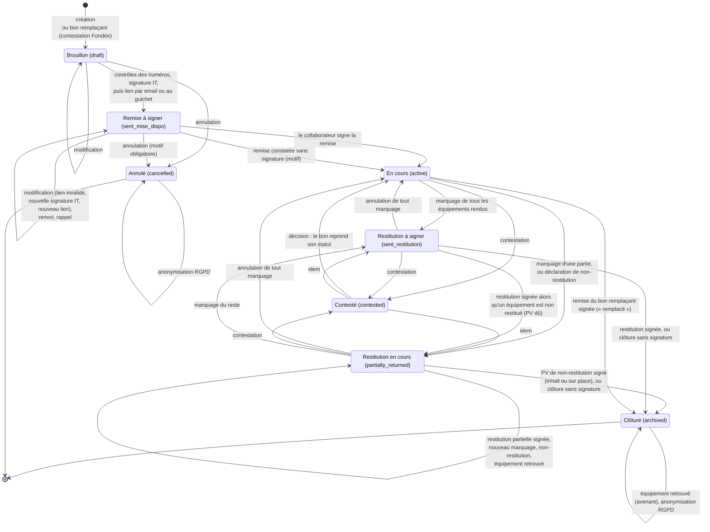

# Architecture de l'application

Document de référence pour le développeur : comment l'application est construite, qui a le droit de faire
quoi, comment un bon passe d'un statut à l'autre, et les pièges déjà rencontrés. Pour démarrer un poste de
développement, lisez d'abord le [README](../README.md). Pour la production, voyez
[deploy/README.md](../deploy/README.md).

Les chiffres donnés ici (modules, modèles, routes) ont été vérifiés dans le code. Le nombre de tests change à
chaque lot : il n'est volontairement pas écrit.

## Sommaire

1. [Vue d'ensemble](#1-vue-densemble)
2. [Vocabulaire](#2-vocabulaire)
3. [Backend](#3-backend)
4. [Frontend](#4-frontend)
5. [Rôles et droits](#5-rôles-et-droits)
6. [Cycle de vie d'un bon](#6-cycle-de-vie-dun-bon)
7. [Carte des routes d'API](#7-carte-des-routes-dapi)
8. [Pièges connus et conventions](#8-pièges-connus-et-conventions)
9. [Définition des indicateurs](#9-définition-des-indicateurs)

---

## 1. Vue d'ensemble

L'application remplace les bons papier de **mise à disposition** et de **restitution** du matériel
informatique de toutes les filiales du groupe. Un technicien crée le bon, le signe (signature IT) et envoie
un lien au collaborateur, qui signe en ligne après authentification Microsoft, ou sur place sur l'appareil
du technicien. Chaque étape produit un PDF figé et scellé. La direction consulte les indicateurs et
l'inventaire du parc prêté.

```
Navigateur ──HTTPS──> reverse proxy (Nginx Proxy Manager, TLS)
                          │
                          ▼
               frontend : nginx + application React (port 8080 dans le conteneur)
                 ├── /*      fichiers statiques de l'application
                 └── /api/*  ──> backend NestJS (port 4000, réseau Docker interne)
                                   ├── PostgreSQL 16 (machine séparée en production, TLS)
                                   ├── volume data/ : images de signature et pièces jointes (chiffrées),
                                   │   logos et cachets des filiales
                                   └── services externes : Entra ID (SSO), Active Directory (LDAP/LDAPS),
                                       serveur SMTP, partage SMB, autorité d'horodatage (facultative)
```

L'installation de production (deux machines, stacks Portainer, sauvegardes) est décrite dans
[deploy/README.md](../deploy/README.md).

**Adresse IP du client.** Elle est enregistrée sur chaque signature et dans le journal d'audit, et sert à la
limitation de débit : c'est un élément de preuve. Le reverse proxy pose `X-Real-IP` avec l'adresse de la
connexion, en écrasant la valeur qu'enverrait le poste, **à condition** que le bloc Advanced de son proxy host
contienne `set_real_ip_from 127.0.0.1;`. Sans cette ligne, Nginx Proxy Manager croit l'`X-Real-IP` envoyé par
toute machine d'un réseau privé, et un poste du réseau local choisit l'adresse enregistrée sur ses signatures.
Le nginx du frontend (`frontend/nginx.conf`) retient ensuite, dans cet ordre, `CF-Connecting-IP`
seulement si le conteneur tourne avec `TRUST_CF_CONNECTING_IP=1` (derrière Cloudflare ; `0` par défaut), puis
`X-Real-IP`, puis l'adresse de la connexion, et écrase `X-Real-IP` et `X-Forwarded-For` avec cette même
valeur avant de joindre le backend. Côté backend, la règle commune est `clientIp()`
(`backend/src/common/http/client-ip.ts`) : l'adresse `req.ip` qu'Express tire de `X-Forwarded-For` avec un seul
proxy de confiance, celle que voit aussi le limiteur de débit. Les contrôleurs d'authentification, des bons et
de signature lisent encore `X-Real-IP` directement, jusqu'à leur reprise en vague 3 ; les deux en-têtes portent
la même adresse. Cette chaîne n'est fiable que si le frontend n'est joignable que par le reverse proxy et si
ce dernier est réglé comme indiqué : le bloc Advanced exact et les trois conditions sont dans
[deploy/README.md, « Adresse IP des signataires »](../deploy/README.md#adresse-ip-des-signataires).

### Pile technique

| Couche | Choix |
|---|---|
| Backend | NestJS 12, TypeScript, Node 22 |
| Base de données | PostgreSQL 16, Prisma 5 |
| Frontend | React 18, Vite 6, react-router 7, Tailwind CSS 3 et composants shadcn/ui (Radix), Recharts |
| Authentification | Microsoft Entra ID (`@azure/msal-node`, PKCE), compte local de secours, JWT en cookies httpOnly |
| Annuaire | `ldapjs` (LDAP ou LDAPS) |
| Emails | `nodemailer` (SMTP) |
| PDF | PDFKit, polices DejaVu Sans embarquées |
| Tâches planifiées | `@nestjs/schedule` |
| Limitation de débit | `@nestjs/throttler` |
| Tests | Vitest (backend et frontend), Testing Library, Playwright : voir [testing-guide.md](testing-guide.md) |
| Intégration continue | GitHub Actions (`.github/workflows/docker.yml`), images publiées sur `ghcr.io` |

### Principes structurants

- **La configuration applicative vit en base**, pas dans des variables d'environnement : table `AppConfig`
  (rubrique + clé), secrets chiffrés en AES-256-GCM, modifiables depuis l'écran d'administration sans
  redémarrage. Les rubriques et les clés acceptées sont listées dans `ALLOWED_CONFIG_KEYS`
  (`backend/src/admin/admin.controller.ts`) ; une clé ajoutée là doit avoir un consommateur côté serveur et un
  champ à l'écran. L'environnement ne porte que le strict nécessaire : `ENCRYPTION_KEY`, `JWT_SECRET`,
  `DATABASE_URL`, `FRONTEND_URL`, `DEFAULT_ADMIN_PASSWORD` (facultatif), `NODE_ENV`, et `APP_VERSION` /
  `APP_COMMIT` posés par la construction de l'image.
- **`ENCRYPTION_KEY` ne change jamais.** Elle chiffre les secrets de configuration, les images de signature et
  les pièces jointes. Un canari au démarrage bloque le backend si la clé ne correspond plus aux données.
- **Les documents sont figés.** Chaque PDF produit est stocké en base (`PdfSnapshot`, **un document par
  signature et par contenu, jamais écrasé** : deux restitutions, ou un PV réémis avec la même signature IT,
  donnent deux documents ; seul un doublon exact est écarté) et copié dans une archive probante
  qui n'est jamais réécrite (`ProofArchive`). L'empreinte tracée dans l'audit est toujours celle d'un document
  téléchargeable. Les signatures sont
  scellées par HMAC ; un horodatage RFC 3161 peut s'y ajouter.
- **Le serveur est la seule autorité** sur les droits et sur l'état d'un bon. Le frontend masque ce qui n'est
  pas permis, il ne protège rien.

---

## 2. Vocabulaire

Un objet, un mot, partout : menus, titres, emails, PDF, exports et documentation. Le code garde ses noms
internes, en anglais ou abrégés. Ce tableau est le lexique décidé par le propriétaire ; les écrans l'adoptent au
fil de la refonte. Les libellés vivent à deux endroits qui emploient les mêmes mots :
`frontend/src/domain/labels.ts` pour l'interface (voir [frontend-guide.md](frontend-guide.md)), et, côté
serveur, `backend/src/bons/bon-status.ts` (statuts) et `backend/src/common/category-labels.ts` (catégories)
pour les emails, les PDF et les exports. Changer un mot, c'est changer les deux.

| Notion | Mot retenu | Nom ou valeur dans le code |
|---|---|---|
| Page de gestion des comptes | **Utilisateurs** | `User`, `/admin/utilisateurs` |
| Personne qui reçoit du matériel | **collaborateur** | `collaborateur`, rôle `collaborator` |
| Ligne du catalogue | **article** (menu « Catalogue », onglets Articles et Packs) | `EquipmentCatalog` (un pack : `EquipmentPack`) |
| Objet physique prêté | **équipement** | `BonEquipment` |
| Matériel qui ne revient pas | **non restitué** | `notReturned` |
| Image du tampon de la filiale | **cachet de la filiale** | `Filiale.stampPath` |
| Tracé du technicien | **signature IT** | `Signature.type = it_cachet` |
| Document de perte | **PV de non-restitution** | `pv_cloture`, `cloture_equipements_manquants` |
| Deux retards distincts | **Signature en retard** (bons) et **Retour en retard** (équipements), avec leur seuil | signature : `overdue`, seuil `rappels.signature_overdue_days` ; retour : `returnOverdue`, date de restitution prévue dépassée |
| Issue d'une contestation | **Fondée** / **Non retenue** | `resolved` / `rejected` |

Statuts d'un bon :

| Valeur interne (`BonStatus`) | Libellé retenu | Situation |
|---|---|---|
| `draft` | Brouillon | En préparation, seul statut modifiable aujourd'hui |
| `sent_mise_dispo` | Remise à signer | Lien envoyé (ou présentiel ouvert), signature du collaborateur attendue |
| `active` | En cours | Équipements chez le collaborateur |
| `sent_restitution` | Restitution à signer | Tous les équipements sont marqués rendus, signature attendue |
| `partially_returned` | Restitution en cours | Une partie rendue ou déclarée non restituée ; un sous-état calculé par le serveur précise quoi faire (« PV à signer », « Restitution partielle à signer », « Équipements encore chez le collaborateur », « Perte déclarée ») |
| `archived` | Clôturé | Bon terminé ; la valeur interne `archived` est conservée |
| `cancelled` | Annulé | Abandonné avant signature |
| `contested` | Contesté | Le collaborateur conteste la remise, la restitution ou le PV ; en attente de décision de l'IT (aucune signature possible) |

---

## 3. Backend

Le code est rangé par domaine dans `backend/src/<domaine>/`, un module NestJS par domaine. Les tests sont à
côté des sources, dans des dossiers `__tests__/`. Tout ce qui est partagé entre domaines va dans
`backend/src/common/` (tableau ci-dessous). Toutes les routes sont préfixées par `/api`. Les types des réponses
que lit le frontend sont dans `backend/src/contracts/`, recopiés dans `frontend/src/contracts/` par
`npm run sync-contracts` (voir § 7).

### Utilitaires communs

Chaque règle transversale a un seul emplacement. Un service l'importe, il ne la recopie pas.

| Fichier | Contenu |
|---|---|
| `common/dates/paris.ts` | Seule implémentation des dates « à l'heure de Paris ». Fonctions JavaScript : aujourd'hui à Paris, format JJ/MM/AAAA, validation d'une date AAAA-MM-JJ, bornes de jour et de mois, jours écoulés. Fragments `Prisma.sql` équivalents : bornes d'un jour, période, regroupement par jour, semaine ou mois, date du jour |
| `common/csv/` | Fabrication des exports : échappement anti-formule, BOM, assemblage (`buildCsv`). `sendCsv(res, { filename, rows, truncated })` pose `Content-Type`, le nom de fichier daté à Paris, `X-Truncated` et `Access-Control-Expose-Headers` |
| `common/http/client-ip.ts` | Adresse IP du client tracée dans l'audit et les signatures : `req.ip`, celle que voit aussi le limiteur de débit (`trust proxy` = `TRUSTED_PROXY_HOPS`) |
| `common/storage-paths.ts` | Dossiers de `data/` (logos et cachets, signatures, pièces jointes) et `dataPath()`, qui refuse un chemin sortant de `data/` |
| `bons/bon-status.ts` | Ordre, libellés et listes nommées des statuts d'un bon : clôturés, en cours de traitement, à signer, annulables, etc. Libellés de la vague 2 : sous-états de « Restitution en cours », issues de contestation, gestes sans signature, motifs d'invalidation d'un lien, civilités (mêmes mots que `frontend/src/domain/labels.ts`) |
| `common/can-send-link.ts` | La règle unique « peut-on envoyer un lien de signature à ce collaborateur ? » (voir ci-dessous) |
| `common/events/` | Événements du domaine : noms, charges utiles, `DomainEventsPublisher`, décorateur `@OnDomainEvent` (voir ci-dessous) |
| `common/bon-predicates.ts` | Prédicats des indicateurs, partagés par la tuile et la liste qu'elle ouvre : signatures attendues, signature en retard, lien expiré, retour en retard, contestations à traiter, parc en circulation et situations (voir § 9) |
| `common/category-labels.ts` | Libellés des catégories d'article |
| `common/roles.ts`, `email.ts`, `bon-reference.ts`, `tokens.ts`, `signature-data-url.ts`, `query-utils.ts`, `types.ts` | Rôles IT, adresse email délivrable, numérotation des bons, jetons de signature, contrôle d'une image de signature, lecture d'un entier de requête, types partagés |

### Modules

Vingt modules sont enregistrés dans `AppModule` :

| Module | Dossier | Responsabilité |
|---|---|---|
| `DomainEventsModule` | `common/events/` | Bus d'événements du domaine en mémoire (@nestjs/event-emitter), global |
| `PrismaModule` | `prisma/` | Client Prisma partagé |
| `ConfigModule` | `config/` | Paramètres applicatifs en base, chiffrement des secrets (`EncryptionService`), cache de 5 minutes, secrets masqués en lecture |
| `TemplatesModule` | `templates/` | Les 19 modèles d'email : texte par défaut, personnalisation en base, rendu des variables `{{…}}`, aperçu avec un vrai bon |
| `AuthModule` | `auth/` | SSO Entra ID, compte local et politique de mot de passe, jetons JWT, révocation, gardes `JwtAuthGuard` et `RolesGuard`, rôle recalculé depuis les groupes Entra |
| `AdminModule` | `admin/` | Paramètres par rubrique et leur état, tests de connexion (LDAP, SMTP, Entra, SMB), synchronisation de l'annuaire, rôle d'un utilisateur, déverrouillage, supervision (exports SMB, emails en échec, tâches planifiées), diagnostic SSO, modèles d'email et PDF |
| `LdapModule` | `ldap/` | Synchronisation Active Directory, garde-fou contre une désactivation massive, alerte quand un compte désactivé détient encore des équipements |
| `FilialesModule` | `filiales/` | Filiales : fiche, logo, cachet de la filiale, import et export CSV |
| `EquipmentModule` | `equipment/` | Catalogue (articles et packs), import CSV, historique d'un équipement par n° de série ou d'inventaire, conflits de numéros de série |
| `UsersModule` | `users/` | Recherche d'utilisateurs, comptes manuels (collaborateurs sans compte Active Directory) et leur import/export CSV |
| `NotificationModule` | `notification/` | Envoi SMTP, journal des emails (`NotificationLog`), rappels de signature, rappel avant restitution, alertes à l'IT |
| `SignatureModule` | `signature/` | Liens de signature, signature du collaborateur, signature IT, scellement HMAC, horodatage facultatif, images chiffrées |
| `BonsModule` | `bons/` | Cœur métier : création, envoi, restitution, non-restitution, équipement retrouvé, clôture, annulation, listes, compteurs, export CSV, PDF d'un bon |
| `AuditModule` | `audit/` | Lecture, filtres et export du journal d'audit |
| `ContestationModule` | `contestation/` | Contestations : création par le collaborateur (route `POST /bons/:id/contestation`), prise en charge, décision Fondée / Non retenue, suivi par le collaborateur, relance de l'IT à 7 jours ouvrés |
| `AttachmentsModule` | `attachments/` | Pièces jointes d'un bon, chiffrées sur disque |
| `RetentionModule` | `retention/` | Anonymisation RGPD (plancher de 60 mois, simulation préalable) et purges techniques (liens expirés, journal d'audit, pièces jointes) |
| `ReportingModule` | `reporting/` | Inventaire du parc prêté : liste, résumé, regroupement par collaborateur, export. Le nom du dossier est historique |
| `KpiModule` | `kpi/` | Tableau de bord : accueil IT (`aujourdhui`, sans cache) et onglets Parc, Délais, Incidents (cache de 60 secondes) ; définitions au § 9 |
| `MonitoringModule` | `monitoring/` | Suivi des tâches planifiées (`ScheduledJobRun`), sonde de la base, version et commit déployés |

Deux modules sont importés par d'autres plutôt que par `AppModule` : `PdfModule` (`pdf/` : génération PDFKit,
modèles PDF personnalisables, instantanés et archive probante, régénération des PDF manquants) et `SmbModule`
(`smb/` : copie des PDF sur un partage réseau monté, suivi et relance). `health.controller.ts` expose les
sondes `/api/health` (le processus répond) et `/api/health/ready` (la base répond, sinon `503`).

### Organisation du module des bons

`BonsService` est une façade. Le travail est fait par des fonctions à dépendances explicites :

- `bons/workflow/state-machine.ts` : la **machine à états** (voir § 6). Module pur, seule réponse à « que
  peut-on faire maintenant, quel document attend la signature, où va le bon ensuite ? ». Toutes les actions
  passent par `assertActionAllowed` (`bon-guards.ts`), qui refuse en `400` avec le motif affiché à l'écran ;
- `bons/workflow/bon-facts.ts` : les faits que lit la machine, calculés depuis les équipements et les
  signatures (équipements rendus « à signer », lien valide, signature IT posée pour la demande en cours) ;
- `bons/workflow/` : une étape par fichier — `bon-crud` (création, civilité retenue sur le compte),
  `bon-update` (brouillon, ou bon envoyé non signé), `bon-send` et `bon-send-checks` (remise par email ou au
  guichet, contrôles des numéros), `bon-links` (liens : invalidation motivée, email, guichet),
  `bon-restitution` (marquage, annulation d'un marquage, non-restitution), `bon-mark-found`, `bon-cloture`
  (PV de non-restitution), `bon-without-signature` (les deux gestes sans signature), `bon-cancel`,
  `bon-resend`, `bon-replacement` (bon remplaçant d'une contestation Fondée), `bon-after-signature` (suites
  de `signature.signed`) ; dépendances regroupées dans `bon-context.ts` ;
- `bons/bon-view.ts` et `bons/bon-list-view.ts` : mise en forme des réponses (fiche, liste) avec l'état
  calculé ; le collaborateur titulaire ne reçoit jamais `internalNote`, `linkRefusal` ni `availableActions` ;
- `bons/queries/` : filtres de liste (dont `overdue`, `awaitingSignature`, `linkExpired`, mêmes prédicats que
  les tuiles de l'accueil), tri, projection allégée, compteurs de l'accueil ;
- `bons/validation/` : filiale et collaborateur actifs, catalogue, numéros de série en double dans un même
  bon, possibilité d'envoi. Un numéro déjà en circulation sur un autre bon se cherche avec
  `findSerialConflicts` (`equipment/equipment-serial.ts`), la même fonction que l'écran de saisie ;
- `bons/bon-status.ts` : ordre, libellés et listes nommées des statuts ;
- `bons/export/` : export CSV.

`signature/` ne connaît pas `bons/` : après chaque signature du collaborateur, il écrit le nouveau statut
(règle de `statusAfterSignature`, présentée par `signature/status-transition.ts`) puis publie
`signature.signed` ; `BonSignatureListener` (`bons/bon-signature.listener.ts`) en tire la suite (PV de
non-restitution, fin de l'attente, bon remplacé). N'importez jamais `BonsService` depuis `signature/`.

### Peut-on envoyer un lien ?

`canSendLink({ active, email })` (`common/can-send-link.ts`) est la seule réponse à cette question. Tout
chemin qui envoie un lien ou un rappel l'appelle : envoi, renvoi, restitution, PV de non-restitution,
équipement retrouvé, rappels automatiques. Deux conditions, dans cet ordre : le compte est **actif** (un
compte désactivé ne peut plus se connecter, donc plus signer à distance), puis l'adresse **du compte**, pas
celle recopiée sur le bon, existe et est délivrable (`isDeliverableEmail`, `common/email.ts`).

La fonction ne lève rien. Elle renvoie `{ allowed: true, email }`, ou `{ allowed: false, reason, message }` :
`reason` vaut `inactive_account`, `no_email` ou `undeliverable_email`, et `message` est une phrase française
affichable. L'écran grise ainsi « Envoyer » et dit pourquoi avant la signature IT, et un rappel passe son
chemin sans écrire d'échec. `assertCanSendLink` est la variante des actions demandées par l'IT : elle renvoie
l'adresse, ou refuse la requête (400) avec le même message.

### Événements du domaine

Un module annonce ce qui vient de se passer, un autre y réagit, sans que l'un importe l'autre. Mécanisme :
`@nestjs/event-emitter` 12 (bus en mémoire du processus), compatible NestJS 12 et publié en ESM comme les
autres paquets `@nestjs` ; vérifié dans les tests (Vitest) et dans le JavaScript CommonJS produit pour la
production. Tout passe par `common/events/` :

| Événement | Publié par | Charge utile (en plus de `bonId`, `bonReference`, `actorId`, `occurredAt`) |
|---|---|---|
| `signature.signed` | signature par lien (`signing.ts`) | `signatureId`, `documentType` (`mise_disposition`, `restitution`, `pv_cloture`), `previousStatus`, `newStatus`, `signerEmail`, `inPerson`, `signedByProxy` |
| `bon.cancelled` | annulation | `previousStatus`, `reason` |
| `bon.handover_without_signature` | « Constater la remise sans signature » | `reason` |
| `bon.closed_without_signature` | « Clôturer sans signature » | `previousStatus`, `reason` |
| `bon.replaced` | signature du bon remplaçant (contestation Fondée) | `replacementBonId`, `replacementBonReference`, `contestationId` |

Règles :

- publier avec `DomainEventsPublisher.publish(DOMAIN_EVENTS.x, charge)` **après** la validation de la
  transaction, jamais dedans. Le nom et la charge sont vérifiés ensemble à la compilation ;
- écouter avec `@OnDomainEvent(DOMAIN_EVENTS.x)` sur une méthode d'un fournisseur Nest. Un écouteur est
  idempotent et relit la base s'il lui faut plus que les faits de la charge, qui est figée ;
- `publish` attend la fin des écouteurs : l'action répond une fois ses suites faites. Un écouteur lent (envoi
  d'email) lance son travail sans l'attendre. Une erreur d'écouteur, synchrone ou asynchrone, est journalisée
  et ne remonte jamais à l'émetteur : ce qui est validé en base le reste ;
- plusieurs écouteurs d'un même événement tournent **en parallèle, sans ordre garanti** : aucun ne doit
  compter sur ce qu'un autre écrit en réaction au même événement ;
- les écouteurs sont branchés au démarrage de l'application (`onApplicationBootstrap`) : un événement publié
  avant, depuis un `onModuleInit` par exemple, n'est reçu par personne.

### Données

`backend/prisma/schema.prisma` décrit **18 modèles** et **13 énumérations**.

| Groupe | Modèles |
|---|---|
| Référentiels | `User`, `Filiale`, `EquipmentCatalog`, `EquipmentPack`, `EquipmentPackItem`, `AppConfig` |
| Bons | `Bon`, `BonEquipment`, `Signature`, `Contestation`, `Attachment` |
| Preuve | `PdfSnapshot` (un document par signature et par contenu, rattaché par `signatureId`, unique sur (bon, type, signature, empreinte) ; le plus récent d'un type est la version en vigueur), `ProofArchive` (copie jamais réécrite) |
| Suivi | `NotificationLog`, `SmbExport`, `AuditLog`, `ScheduledJobRun`, `RevokedToken` |

Énumérations : `UserRole`, `BonStatus`, `Civilite`, `EquipmentCategory`, `SignatureType`, `PdfSnapshotType`,
`SignatureInvalidationReason`, `SmbExportStatus`, `ContestationStatus`, `ContestationOutcome`,
`NotificationType`, `NotificationStatus`, `ScheduledJobStatus`. L'ordre des valeurs de `BonStatus` en base
diffère de celui du schéma : ne triez jamais sur cet ordre (voir § 8).

Colonnes posées pour la vague 2 (migrations `20260925100000_wave2_enum_values` et
`20260925100100_wave2_foundation`, avec reprise des données existantes) :

| Modèle | Champ | Sens |
|---|---|---|
| `User` | `civilite` | Civilité retenue pour le collaborateur ; vide tant qu'un technicien ne l'a pas choisie, jamais de valeur par défaut |
| `Bon` | `notes` / `internalNote` | « Remarques sur le bon » (visibles du collaborateur et sur le PDF) / « Note interne IT » (jamais montrée au collaborateur) |
| `Bon` | `awaitingSince` | Début de l'attente de signature du document courant : posé à chaque nouvelle demande, pas au renvoi ; sert aux retards et aux rappels à la place d'`updatedAt` |
| `Bon` | `cancelledAt`, `cancellationReason` | Annulation et son motif |
| `Bon` | `handoverWithoutSignatureReason`, `closedWithoutSignatureReason` | Motifs des deux gestes sans signature |
| `Bon` | `replacesBonId` (relations `replacesBon` / `replacedBy`) | Contestation Fondée : le nouveau bon pointe vers celui qu'il remplace |
| `Signature` | `invalidatedAt`, `invalidatedReason` | Quand et pourquoi un lien a été invalidé avant usage (`SignatureInvalidationReason`) |
| `Contestation` | `previousBonStatus` | Statut à rétablir si la contestation n'est pas retenue (le journal d'audit n'est plus relu) |
| `Contestation` | `contestedDocument` | Remise, restitution ou PV de non-restitution |
| `Contestation` | `outcome` (`founded` / `not_retained`) | Issue « Fondée » / « Non retenue » ; `status` reste aligné (`resolved` / `rejected`) |
| `Contestation` | `reviewedById`, `reviewedAt` / `resolvedById`, `resolvedAt` | « Pris en charge par » / « Tranché par » |
| `NotificationLog` | `documentType` | Document d'une demande ou d'un rappel : les rappels se comptent par document |

Nouvelles valeurs : `PdfSnapshotType` `remise_sans_signature` et `cloture_sans_signature` ; `NotificationType`
`handover_without_signature`, `contestation_overdue_alert` et `link_request_alert` ; `NotificationStatus`
`skipped` (email volontairement non envoyé, par exemple à un collaborateur sans adresse : ce n'est pas un
échec).

Les migrations sont dans `backend/prisma/migrations/`. Le backend de production les applique au démarrage
(`prisma migrate deploy`). La CI rejoue toutes les migrations sur une base neuve et échoue si
`schema.prisma` a changé sans migration.

### Tâches planifiées

Toutes sont déclarées dans le registre `backend/src/monitoring/job-registry.ts`, suivies dans
`ScheduledJobRun` et visibles côté administration.

| Tâche | Quand (heure de Paris) | Effet |
|---|---|---|
| Synchronisation de l'annuaire | toutes les 6 h ; un intervalle plus long se règle (`ldap.sync_interval_hours`) | Comptes créés, mis à jour ou désactivés ; alerte de départ |
| Rappels de signature | jours ouvrés, 9 h | Trois rappels au plus **par document** (remise, restitution, PV), comptés depuis la demande de ce document (`Bon.awaitingSince`) ; aucun rappel vers un compte désactivé, sans adresse ou à l'adresse invalide : une seule ligne par document (`skipped`, ou `failed` « adresse à corriger »), jamais une par jour |
| Rappel avant restitution | tous les jours, 9 h | Prévient le collaborateur avant la date de restitution prévue (un seul envoi par bon ; compte désactivé ou sans adresse : une ligne « non envoyé ») |
| Rétention RGPD | dimanche, 3 h | Anonymisation et purges techniques |
| Relance des exports SMB | toutes les 6 h | Nouvelle tentative des copies en échec, trois relances au plus par copie |
| Relance des contestations non traitées | jours ouvrés, 9 h | Un email récapitulatif à tous les admins et techniciens actifs pour les contestations non tranchées depuis plus de 7 jours ouvrés (samedi et dimanche exclus, calendrier de Paris, jours fériés non retirés ; lien direct vers chaque bon) ; au plus une relance par bon tous les 7 jours ouvrés (`NotificationLog`, type `contestation_overdue_alert`) |

Aucune tâche planifiée ne change le statut d'un bon.

### Modèles d'email et de PDF

Dix-neuf modèles d'email, définis dans `backend/src/templates/template-catalog.ts` : `mise_disposition_request`,
`restitution_request`, `pv_cloture_request`, `confirmation_mise_disposition`, `confirmation_restitution`,
`confirmation_pv_cloture`, `reminder`, `restitution_due_reminder`, `contestation_alert`,
`contestation_resolved`, `contestation_rejected`, `departure_alert`, puis les emails d'information et
alertes : `bon_cancelled` (annulation, avec son motif), `handover_without_signature` (remise constatée sans
signature), `closed_without_signature`, `bon_replaced`, `equipment_found`, `link_request_alert` (nouveau lien
demandé) et `contestation_overdue_alert` (relance des contestations à trancher). Chaque email envoyé a donc
son modèle personnalisable. Le texte par défaut est dans `templates/defaults/` ; une personnalisation est
enregistrée dans `AppConfig` (rubrique `email_templates`) et peut être réinitialisée. Les variables (texte
saisi échappé, listes et boutons construits en HTML) viennent de `notification/messages/` et de
`templates/contestation-overdue-alert.ts`.

**Qui reçoit quoi.** Un email au collaborateur part à l'adresse **actuelle** de son compte, si le compte est
actif (`canSendLink`) ; sinon une ligne `skipped` (compte désactivé, pas d'adresse) ou `failed` (adresse
invalide) est écrite dans `NotificationLog`. La réponse à une contestation suit la même règle. Un email
impossible à construire (modèle illisible, PDF joint introuvable) devient lui aussi une ligne `failed` du
journal du bon, visible dans « emails en échec ». Les alertes à l'IT (contestation, nouveau lien demandé, départs,
contestations en retard) partent à tous les administrateurs et techniciens actifs, avec un **lien direct**
(`notification/app-links.ts`). La confirmation de signature contient le lien vers le portail et joint le PDF
signé (4 Mo au plus). Les dates des emails sont à l'heure de Paris.

**Emails qui suivent un événement** (`notification/listeners/bon-events.listener.ts`) : `signature.signed` →
confirmation ; `bon.cancelled` → annulation avec motif (sauf un brouillon) ; `bon.handover_without_signature`
→ « remise constatée sans signature » ; `bon.closed_without_signature` → « bon clôturé sans signature » ;
`bon.replaced` → « bon remplacé ».

**PDF : ce que dit chaque document.** Le PDF choisit lui-même les signatures de **son** document
(`pdf/document-signatures.ts`) : la case IT porte le technicien qui a signé ce document (`Signature.pdfType` :
`mise_disposition`, `restitution`, `pv_cloture`, `avenant`), la case collaborateur la signature de ce document
et sa date ; une signature IT invalidée (bon modifié) ne compte plus ; les images sont celles de ces
signatures, et le certificat ne liste qu'elles. Les noms viennent des comptes (par l'adresse de signature),
le cachet de la filiale est lu par `filialeId`. Au guichet, le signataire reste le collaborateur, « en présence
de » le technicien qui tenait la tablette ; seul un compte ni titulaire ni IT est un mandataire (« pour le
compte de ») ; une signature IT n'est jamais « au guichet ». Un document de restitution ne liste sous
« Équipements restitués » que ce qui a été rendu dans CETTE restitution, rappelle ce qui l'avait été avant, et
range le reste sous « Restent chez le collaborateur » (`pdf/render/restitution-scope.ts`) ; il est daté de sa
signature. Chaque document enregistré porte un nom lisible et daté
(`BON-…_Lea-Martin_Bon-de-restitution-signe_2026-09-27_15h03m27.pdf`, `pdf/snapshot-filename.ts`) ; les
pièces jointes des emails aussi (`BON-…_PV-de-non-restitution_2026-09-27.pdf`). Un document
« signature du collaborateur » est refusé si le collaborateur n'a pas signé ce document ; un geste sans
signature est rangé sous `remise_sans_signature` / `cloture_sans_signature`, avec le motif, le technicien et
la date (écouteur `signature/without-signature-documents.listener.ts`).

Quatre modèles de PDF (`backend/src/pdf/pdf-template-definitions.ts`) : `mise_disposition`,
`restitution`, `cloture` (PV de non-restitution) et `avenant` (équipement retrouvé après clôture). Leur mise
en forme (couleurs, polices, marges, textes, sections affichées) est un JSON validé ; seules les valeurs
modifiées sont stockées (`AppConfig`, rubrique `pdf_templates`).

### Journal d'audit

Chaque action significative écrit une ligne `AuditLog` : action en `snake_case` préfixée par l'entité
(`bon_`, `signed_`, `login_`, `contestation_`…), auteur, bon concerné, adresse IP, agent utilisateur et
détails en JSON. Toute nouvelle action reçoit son libellé dans
`frontend/src/pages/admin/audit-logs/actionMeta.ts`. Aujourd'hui, chaque module écrit directement dans la
table ; un service d'audit unique avec un catalogue d'actions est prévu (vague 3), ainsi que la trace des
changements de paramètres (sans secret) et des filiales.

---

## 4. Frontend

`frontend/src/` est organisé ainsi :

| Dossier | Contenu |
|---|---|
| `pages/` | Un dossier par écran ou domaine (`bons/`, `dashboard/`, `inventaire/`, `materiel/`, `portail/`, `signature/`, `admin/…`), avec ses composants, ses hooks et sa logique pure testée |
| `components/ui/` | Composants shadcn/ui (Radix + Tailwind) |
| `components/layout/` | Coque de l'application : menu latéral (tiroir sur téléphone), en-tête, recherche globale (loupe plein écran sur téléphone), fil d'Ariane, sous-menu d'administration ; voir frontend-guide.md §4.1 |
| `components/dashboard/` | Tuiles et graphiques partagés par le tableau de bord |
| `components/list/` | Briques communes des listes : pagination 25 / 50 / 100, en-tête de colonne triable, états chargement / vide / erreur, bascule du tableau en cartes sur téléphone |
| `hooks/` | Hooks transverses. Listes : `useUrlFilters` (filtres dans l'adresse), `usePagination`, `useSort`, `useDebounce` ; `useDownload` (téléchargement), `usePageTitle` (titre d'onglet) ; et aussi chargement d'une ressource, filiales actives, canevas de signature, notifications, saisie non enregistrée |
| `lib/` | Client HTTP (`api.ts` : cookies, en-tête anti-CSRF, rafraîchissement du jeton), rôles, emails, dates, formats, validation |
| `domain/` | `labels.ts`, le lexique : chaque libellé métier affiché à l'écran (voir § 2) |
| `contracts/` | Types des réponses de l'API, **copie générée** de `backend/src/contracts/` : on modifie la source côté backend puis on relance `npm run sync-contracts` ; la CI échoue si la copie n'est pas à jour |
| `contexts/` | Session (`AuthContext`), thème clair ou sombre, vue d'interface |
| `types/` | Types partagés |
| `test/` | `render.tsx` (rendu avec routeur), `url-hook.tsx` (hook qui lit ou écrit l'adresse) et `setup.ts` (configuration de Vitest) |

Les conventions du frontend (appels d'API, listes, dates, libellés, formulaires, retours à l'utilisateur,
accessibilité, mobile) sont dans [frontend-guide.md](frontend-guide.md).

### Écrans et adresses (état actuel)

| Adresse | Écran | Rôles |
|---|---|---|
| `/login`, `/change-password` | Connexion (SSO ou compte local), changement de mot de passe | public, puis compte connecté |
| `/signer/:token` | Signature d'un document par le collaborateur | lien reçu par email : le collaborateur se connecte (Microsoft) ; en présentiel, la session du technicien suffit. **Adresse figée** : elle figure dans des emails déjà envoyés |
| `/dashboard` | Tableau de bord à onglets : Aujourd'hui, Parc, Délais, Incidents | IT, `direction` (sans « Aujourd'hui ») |
| `/bons`, `/bons/new`, `/bons/:id`, `/bons/:id/edit` | Liste, création, fiche et modification d'un bon | IT |
| `/inventaire` | Parc prêté, par équipement ou par collaborateur | IT, `direction` |
| `/materiel/:reference` | Historique d'un équipement (n° de série ou d'inventaire) | IT, `direction` (sans lien vers les bons) |
| `/mes-bons`, `/mes-bons/:id` | Portail du collaborateur | compte connecté |
| `/admin/contestations`, `/admin/catalogue` | Contestations, catalogue | IT |
| `/admin/utilisateurs`, `/admin/filiales` | Utilisateurs, filiales | `admin` |
| `/admin/configuration/*` | Paramètres : `general`, `ldap`, `entra`, `smtp`, `rappels`, `tokens`, `smb`, `timestamp`, `retention`, `monitoring` | `admin` |
| `/admin/templates/email`, `/admin/templates/pdf` | Modèles d'email et de PDF | `admin` |
| `/admin/ldap-sync`, `/admin/audit` | Synchronisation de l'annuaire, journal d'audit | `admin` |

« IT » désigne les rôles `admin` et `technician`. Une adresse refusée au rôle mène à la page 403
(`/unauthorized`, « Vous n'avez pas accès à cette page »), une adresse inconnue à « Page introuvable ». Les
anciennes adresses `/admin/reports`, `/admin/ldap`, `/admin/email-templates` et `/admin/pdf-templates`
redirigent vers les nouvelles.

Aujourd'hui, le menu latéral de l'administrateur compte trois groupes (Suivi, Référentiels,
Administration) ; celui du technicien n'a que les deux premiers, sans Utilisateurs ni Filiales. La direction
voit Tableau de bord et Inventaire, le collaborateur une seule entrée « Mes équipements » (adresse `/mes-bons`
jusqu'à la vague 4). Un sélecteur de vue permet à un membre de l'IT
de voir l'interface d'un autre rôle. **Cible décidée** (vague 4) : menu
Suivi (Accueil `/accueil`, Bons, Inventaire, Contestations), Référentiels (Utilisateurs `/utilisateurs`,
Filiales `/filiales`, Catalogue `/catalogue`) et Administration (Paramètres, Modèles, Supervision, Journal
d'audit), des adresses en français avec redirection de toutes les anciennes, la suppression du sélecteur de
vue, et « Mes équipements » (`/mes-equipements`) pour chacun en bas du menu. `/signer/:token` ne change pas.

---

## 5. Rôles et droits

### Les quatre rôles

| Rôle (`UserRole`) | Qui |
|---|---|
| `admin` | Administrateurs de l'application |
| `technician` | Techniciens de l'équipe IT |
| `direction` | Direction : lecture des indicateurs et de l'inventaire |
| `collaborator` | Tout autre compte : reçoit des équipements, signe, conteste |

`admin` et `technician` forment le personnel IT (`isItRole()` dans `backend/src/common/roles.ts`, miroir
d'affichage dans `frontend/src/lib/roles.ts`).

### Attribution

- **Connexion Microsoft** : le rôle est recalculé à **chaque** connexion depuis les groupes Entra présents dans
  le jeton (`backend/src/auth/role-mapping.ts`). Priorité `admin` > `technician` > `direction` >
  `collaborator`. Les identifiants de groupe se règlent dans les paramètres Entra ID. Il faut, côté Entra, une
  revendication de groupes (groupes de sécurité, identifiant de groupe, jeton d'identité) ; sans elle, le rôle
  enregistré est conservé et le diagnostic SSO de l'écran d'administration l'indique.
- **Compte local** : `admin@local`, créé au premier démarrage. Son mot de passe vient de
  `DEFAULT_ADMIN_PASSWORD`, sinon il est tiré au hasard et écrit dans `data/initial-admin-password.txt`
  (supprimé au premier changement de mot de passe, obligatoire). Un administrateur peut changer le rôle d'un
  compte local ; pour un compte Microsoft, les groupes l'emportent à la connexion suivante.
- **Comptes manuels** : collaborateurs sans compte Active Directory, créés à la main, avec ou sans adresse. Ils
  ne peuvent pas se connecter et la synchronisation de l'annuaire ne les touche jamais. Sans adresse, leurs
  documents se signent en présentiel.

### Session

Deux cookies httpOnly : le jeton d'accès (15 minutes, limité à `/api`) et le jeton de rafraîchissement
(8 heures, limité à `/api/auth`), révocable. Toute requête qui modifie quelque chose porte l'en-tête
`X-Requested-With` (protection CSRF, posée par `frontend/src/lib/api.ts`). Un compte local est verrouillé
30 minutes après une série d'échecs. Un compte qui doit changer son mot de passe n'accède à rien d'autre.
Le détail et les règles à respecter sont dans [security.md](security.md).

### Qui peut faire quoi

Décision du propriétaire : le technicien gère le **Catalogue**, mais plus les Utilisateurs ni les Filiales.

| Domaine | `admin` | `technician` | `direction` | `collaborator` |
|---|---|---|---|---|
| Bons : créer, envoyer, restituer, clôturer, annuler | oui | oui | non | non |
| Contestations : prendre en charge, décider | oui | oui | non | non |
| **Ses propres** bons : consulter, PDF, pièces jointes, signer, contester | oui | oui | oui | oui |
| Tableau de bord | oui | oui | oui, sans l'onglet « Aujourd'hui » | non |
| Inventaire, historique d'un équipement | oui | oui | lecture, sans lien vers les bons | non |
| Catalogue (articles et packs) : lire et modifier | oui | oui | non | non |
| Recherche du destinataire d'un bon, fiche d'une personne en lecture, liste des comptes IT (filtre « Créé par ») | oui | oui | non | non |
| Gestion des utilisateurs : liste de l'écran Utilisateurs, comptes manuels (y compris depuis le formulaire de bon), import et export, rôle, déverrouillage | oui | non | non | non |
| Gestion des filiales : liste complète, création, modification, logo, cachet, suppression, import et export | oui | non | non | non |
| Liste des filiales actives, pour les formulaires et les filtres | oui | oui | oui | non |
| Synchronisation de l'annuaire | oui | non | non | non |
| Paramètres, modèles d'email et de PDF (lecture comprise), supervision, journal d'audit, rétention | oui | non | non | non |

Le serveur fait foi : chaque route déclare ses rôles, et une route non déclarée est refusée, même à un
administrateur (voir § 7). Sur une route ouverte à tout compte connecté, un compte non IT n'atteint que ses
propres bons (`verifyCollaboratorAccess`, `backend/src/bons/bons-access.ts`) ; la direction y a accès comme
tout le monde, puisqu'elle peut aussi recevoir des équipements. Le chemin du cachet d'une filiale n'est jamais
renvoyé à un compte non IT. L'interface suit ces droits : le technicien ne voit ni Utilisateurs ni Filiales
dans le menu, et leurs adresses le mènent à la page 403. Le modèle d'accès complet, avec la marche à suivre
pour ajouter une route, est dans [security.md, « Modèle d'accès »](security.md).

---

## 6. Cycle de vie d'un bon

### Statuts et transitions

Les états portent le libellé retenu et, entre parenthèses, la valeur interne.


```mermaid
stateDiagram-v2
    state "Brouillon (draft)" as draft
    state "Remise à signer (sent_mise_dispo)" as sent_mise_dispo
    state "En cours (active)" as active
    state "Contesté (contested)" as contested
    state "Restitution à signer (sent_restitution)" as sent_restitution
    state "Restitution en cours (partially_returned)" as partially_returned
    state "Clôturé (archived)" as archived
    state "Annulé (cancelled)" as cancelled

    [*] --> draft : création<br/>ou bon remplaçant (contestation Fondée)
    draft --> draft : modification
    draft --> sent_mise_dispo : contrôles des numéros, signature IT,<br/>puis lien par email ou au guichet
    draft --> cancelled : annulation

    sent_mise_dispo --> active : le collaborateur signe la remise
    sent_mise_dispo --> active : remise constatée sans signature (motif)
    sent_mise_dispo --> sent_mise_dispo : modification (lien invalidé,<br/>nouvelle signature IT, nouveau lien),<br/>renvoi, rappel
    sent_mise_dispo --> cancelled : annulation (motif obligatoire)

    active --> sent_restitution : marquage de tous les équipements rendus
    active --> partially_returned : marquage d'une partie,<br/>ou déclaration de non-restitution
    sent_restitution --> active : annulation de tout marquage
    partially_returned --> active : annulation de tout marquage
    active --> contested : contestation
    sent_restitution --> contested : contestation
    partially_returned --> contested : contestation
    contested --> active : décision : le bon reprend son statut
    contested --> sent_restitution : idem
    contested --> partially_returned : idem

    partially_returned --> partially_returned : restitution partielle signée,<br/>nouveau marquage, non-restitution,<br/>équipement retrouvé
    partially_returned --> sent_restitution : marquage du reste
    partially_returned --> archived : PV de non-restitution signé<br/>(email ou sur place), ou clôture sans signature
    sent_restitution --> archived : restitution signée, ou clôture sans signature
    sent_restitution --> partially_returned : restitution signée alors<br/>qu'un équipement est non restitué (PV dû)
    active --> archived : remise du bon remplaçant signée (« remplacé »)

    archived --> archived : équipement retrouvé (avenant), anonymisation RGPD
    cancelled --> cancelled : anonymisation RGPD
    archived --> [*]
    cancelled --> [*]
```

**Machine à états** (`bons/workflow/state-machine.ts`). Une table dit, pour chaque action, ses statuts de
départ et sa condition sur les équipements ; les actions qui envoient un email suivent en plus `canSendLink`.
La fiche d'un bon expose le résultat : `availableActions` (actions proposées, avec l'action principale en tête
et le motif de celles qui sont bloquées), `pendingSignature` (document en attente : type, lien expiré ou non,
au guichet, signature IT posée, dates d'envoi et d'échéance), `subStatus`, `lateness` (« Signature en
retard », « Retour en retard ») et, pour chaque équipement, `returnState`. L'écran n'en recalcule rien.
Pour l'IT seulement, la fiche porte aussi deux rappels lus à part (`bons/bon-it-notices.ts`) :
`contestation` (étape `open` : bon « Contesté », contestation nouvelle ou prise en charge, motif et « Traiter
la contestation », qui ouvre directement sa décision : `/admin/contestations?contestation=<id>` ; étape `correction` :
Fondée sur une restitution ou un PV et rien corrigé depuis la décision — ni geste de correction au journal,
ni nouvelle signature IT, ni nouveau lien) et `linkRequest` (le collaborateur a demandé un nouveau lien
depuis le dernier envoi). Pendant l'étape `correction`, l'action principale devient le geste de correction
(« Corriger le marquage » pour une restitution, « Équipement retrouvé » pour un PV) au lieu du renvoi.
Chaque signature de la fiche IT porte `signerName`, le nom du compte de `signerEmail` : « par Thomas
Girard », comme le PDF (`bons/bon-signer-names.ts`).
L'écran range les actions (`pages/bons/detail/action-placement.ts`) : tant qu'un document attend la
signature, nouvelles restitutions et déclaration de non-restitution passent dans « Autres actions », et,
lien encore valide, seul « Faire signer sur place » reste visible.

| Action (`BonActionName`) | Depuis | Condition |
|---|---|---|
| `edit` | Brouillon, Remise à signer | |
| `send` | Brouillon | email possible |
| `send_in_person` | Brouillon | |
| `resend`, `show_in_person_link` | Remise à signer, Restitution à signer, Restitution en cours | un document attend la signature (`resend` : email possible) |
| `start_restitution`, `restitution_in_person` | En cours, Restitution en cours | un équipement encore chez le collaborateur (`start_restitution` : email possible) |
| `undo_return` | Restitution à signer, Restitution en cours | un équipement rendu, restitution pas signée ; aussi depuis la fenêtre de restitution (`undoEquipmentIds` de `initiate-restitution`, même transaction que le nouveau marquage) |
| `declare_not_returned` | En cours, Restitution en cours | un équipement encore chez le collaborateur |
| `mark_found` | Restitution en cours, Clôturé | un équipement déclaré non restitué |
| `handover_without_signature` | Remise à signer | motif |
| `close_without_signature` | Restitution à signer, Restitution en cours | plus rien chez le collaborateur, un document attend ; motif |
| `cancel` | Brouillon, Remise à signer | motif obligatoire pour un bon envoyé |

**Document en attente et sous-état.** Ils se déduisent des équipements, jamais d'une ligne de signature en
attente (la purge des liens expirés les supprime) : un équipement marqué rendu **après** la dernière
restitution signée attend sa signature. « Restitution en cours » se lit ainsi, les cas s'excluant : une
restitution attend (« Restitution partielle à signer ») ; sinon, tout est rendu ou perdu (« PV de
non-restitution à signer ») ; sinon, une perte est déclarée (« Perte déclarée ») ; sinon « Équipements
encore chez le collaborateur ».

**Ordre imposé** (R-010, R-022) : marquage des équipements, puis signature IT du document, puis le lien. Le
serveur refuse tout lien d'un document sans sa signature IT : pour la remise, une signature IT non invalidée
(modifier le bon l'invalide) ; pour la restitution, une signature IT postérieure au dernier marquage. Le PV
porte la signature IT recueillie à la déclaration de non-restitution, avec l'adresse IP et le navigateur du
technicien. Avant la signature IT d'une remise, `GET /bons/:id/send-check` liste les lignes sans numéro de
série ni d'inventaire et les numéros déjà prêtés ailleurs : la remise est refusée (`409 missing_serials`,
puis `serial_conflicts`) sauf confirmation, tracée dans l'audit (`bon_sent_without_serial`,
`bon_sent_with_serial_conflicts`), par email comme au guichet.

Autres règles :

- Chaque transition vérifie le statut de départ dans la même transaction que la mise à jour et répond `409`
  si le bon a changé entre-temps. Les liens remplacés sont invalidés dans la même transaction, avec leur motif.
- Jamais deux liens valides pour un même bon. L'émission d'un lien par email (`bons/workflow/bon-links.ts`)
  se fait sous un verrou propre au bon, et l'invalidation de l'ancien lien (« remplacé ») a lieu dans la
  même transaction que la création du nouveau. Deux « Renvoyer » rapprochés (double clic, moins de 30 s)
  ne font qu'un envoi : le second réutilise le lien qui vient de partir, sans email. Sans confirmation, le
  second répond `409 token_recent`.
- La signature n'est écrite que si le lien est **encore** valide au moment de l'écriture (`signature/signing.ts` :
  ni signé, ni invalidé, ni expiré). Si une modification du bon ou l'annulation d'un marquage invalide le lien
  pendant la signature, la réponse est un `400` « Ce lien n'est plus valide… » avec le motif, et le bon
  n'avance pas.
- `awaitingSince` démarre à chaque nouvelle demande (envoi, marquage, PV, modification d'un bon envoyé),
  ne bouge pas au renvoi, et s'arrête quand plus rien n'attend.
- Tout email part à l'adresse **actuelle** du compte ; `collaborateurEmail` reste la trace de la création.
- La civilité est choisie à chaque bon, sans valeur par défaut, et retenue sur le compte (`User.civilite`).
- « Note interne IT » (`internalNote`) : jamais montrée au collaborateur ; « Remarques sur le bon »
  (`notes`) : sur le PDF et dans le portail. Seul un changement du **document** (collaborateur, filiale,
  civilité, dates, remarques, équipements : `bons/workflow/bon-document-diff.ts`) invalide le lien et la
  signature IT d'un bon envoyé ; modifier seulement la note interne ne change rien pour le collaborateur.
- Annuler un marquage ou rouvrir une restitution contestée ne retire sa valeur qu'à la signature IT de la
  restitution **en cours** : celles des restitutions déjà signées restent probantes.
- Motif d'invalidation d'une restitution corrigée : annuler un marquage, ou marquer d'autres équipements
  pendant qu'une restitution attend sa signature, invalide le lien en attente et la signature IT en cours avec
  le motif `return_corrected` (« Restitution corrigée »), ou `in_person` quand le nouveau marquage se fait au
  guichet. L'ancien lien tombe dès le marquage, avant la nouvelle signature IT : il montrerait une autre
  sélection que celle qui sera signée.
- Les numéros de série d'un bon remplaçant ne sont pas signalés « déjà prêtés » à cause de son original :
  `findSerialConflicts` (`equipment/equipment-serial.ts`) exclut, avec le bon en cours (`excludeBonId`), le
  bon qu'il remplace ; le formulaire (`pages/bons/create/lib/serialConflicts.ts`) et le contrôle d'avant la
  remise (`bon-send-checks.ts`) gardent le même filtre.
- Contestation Fondée **sur une remise** : `createReplacementBon` crée un brouillon pré-rempli lié
  (`replacesBonId`), que l'IT corrige puis envoie ; l'original reste « En cours ». Quand la remise du
  remplaçant est signée, ou constatée sans signature, l'original passe « Clôturé » (sa relation `replacedBy`
  dit « remplacé ») et `bon.replaced` est publié.
- Contestation Fondée **sur une restitution ou un PV** : pas de nouveau bon. `reopenForCorrection(bonId,
  document, actorId, tx?)` (`bons/workflow/bon-reopen.ts`) invalide le lien du document (motif `contested`),
  retire sa valeur à la signature IT de restitution et redémarre l'attente ; l'IT corrige avec les actions de
  la fiche (annuler un marquage, restitution, équipement retrouvé) puis relance la signature.

### Documents et signatures

| Étape | Signature (`Signature.type`) | Document PDF (`PdfSnapshotType`) | Emails au collaborateur |
|---|---|---|---|
| Signature IT de la remise | `it_cachet`, `pdfType` `mise_disposition` | `signature_it_mise_disposition` | |
| Remise signée par le collaborateur (email ou présentiel) | `mise_disposition` | `signature_collab_mise_disposition` | demande, rappels, confirmation |
| Signature IT de la restitution | `it_cachet`, `pdfType` `restitution` | `signature_it_restitution` | |
| Restitution signée, totale ou partielle | `restitution` | `signature_collab_restitution`, réécrit à chaque restitution partielle, copie gardée dans `ProofArchive` | demande, rappels, confirmation |
| Signature IT du PV de non-restitution | `it_cachet`, `pdfType` `pv_cloture` | `cloture_equipements_manquants` | |
| PV de non-restitution signé (email ou au guichet, lien de 2 h, mandataire tracé) | `pv_cloture` | `cloture_equipements_manquants` | demande, rappels, confirmation |
| Remise constatée sans signature | aucune, motif obligatoire | `remise_sans_signature` | avis « remise constatée sans signature » |
| Clôture sans signature | aucune, motif obligatoire | `cloture_sans_signature` | avis « bon clôturé sans signature » |
| Équipement retrouvé après clôture | `it_cachet`, `pdfType` `avenant` | `avenant_equipement_retrouve` | avis d'équipement retrouvé |

Un lien invalidé garde son motif (`Signature.invalidatedReason`) : la page de signature dit « remplacé »,
« se signe au guichet », « bon clôturé », « annulé »… plutôt qu'un « nouveau lien envoyé » faux. Un lien
expiré propose « Demander un nouveau lien » : l'IT est prévenue une seule fois par lien en attente ; tant
qu'elle ne l'a pas renvoyé, les demandes suivantes répondent « déjà demandé le … » sans nouvelle alerte.

Autres emails : annulation d'un bon déjà envoyé, réponse à une contestation, rappel avant la date de
restitution prévue. L'IT reçoit une alerte à chaque contestation et quand un compte désactivé détient encore
des équipements.

Un lien de signature envoyé par email exige une connexion Microsoft du collaborateur concerné. Un lien
présentiel est valable 2 heures et s'ouvre sur l'appareil du technicien : le collaborateur signe « en
présence de » ce compte IT, ce n'est pas une procuration (`signedByProxy` reste faux ; seul un compte ni
titulaire ni IT est tracé comme mandataire).

### Contestation et portail du collaborateur (lot 2C)

**Ce que l'on conteste.** Le document signé ou à signer, décidé par le serveur
(`contestation/contested-document.ts`) : la remise sur un bon « En cours » ; la restitution sur « Restitution
à signer » ; le PV à signer (sinon la restitution partielle à signer) sur « Restitution en cours ». Une remise
pas encore signée ne se conteste pas (on ne la signe pas). Le bon passe « Contesté » et son statut d'avant est
gardé en colonne (`Contestation.previousBonStatus`, plus dans le journal d'audit). Les liens en attente ne sont
pas invalidés : la page de signature annonce la contestation et la signature est refusée tant qu'elle dure.

**Décision** (`contestation/contestation-resolve.ts`), en une transaction :
- **Non retenue** : réponse obligatoire ; le bon reprend son statut, le même lien resservira ;
- **Fondée** : on corrige toujours, par le module Bons (port `BON_CORRECTOR`,
  `contestation/bon-correction.port.ts`, fourni par `BonsService`), dans la même transaction. Le bon reprend
  d'abord son statut (le matériel reste dans l'inventaire et le portail), puis, selon le document contesté :
  - **remise** (ou contestation d'avant la vague 2) : le lien est invalidé (motif `contested` : aucun nouveau
    lien n'est encore parti) et un **bon remplaçant** est créé (`createReplacementBon`), en brouillon
    prérempli lié à l'original. L'IT le corrige et l'envoie ; à sa signature, l'original est clôturé
    « remplacé ». La réponse API porte `replacementBon` ; l'écran ouvre le brouillon ;
  - **restitution ou PV** : **pas de nouveau bon**, le bon d'origine est rouvert (`reopenForCorrection`) :
    lien du document invalidé (motif `contested`), signature IT de restitution retirée. La réponse API
    porte `reopenedDocument` ; l'écran annonce « le bon va être corrigé, puis la restitution (ou le PV) sera
    renvoyée à signer » et ouvre la fiche du bon. Si le document n'attend plus de signature, la décision est
    refusée (400) et rien n'est écrit.
  La réponse au collaborateur (`REPLACEMENT_SENTENCE`, `notification/messages/contestation-messages.ts`) dit
  ce qui va se passer : le bon corrigé qui remplacera le sien, ou « Votre bon va être corrigé, puis la
  restitution (le PV de non-restitution) vous sera renvoyée à signer. »
« Pris en charge par » (`reviewedBy`, `reviewedAt`) et « tranché par » (`resolvedBy`, `resolvedAt`) sont
distincts ; `outcome` porte l'issue, `status` reste aligné pour les listes et indicateurs.

**Liste IT et relance.** `GET /contestations?aTraiter=1` applique le prédicat de la tuile « Contestations à
traiter » (`buildContestationToProcessWhere`, `common/bon-predicates.ts`) : même nombre de lignes que son
chiffre. L'écran garde son filtre dans l'adresse (`filtre=fondees|non-retenues|toutes`, « À traiter » par
défaut). La création d'une contestation est limitée à 5 par minute et par adresse. La relance
(`contestation/overdue/`, jours ouvrés à 9 h, heure de Paris) écrit une ligne `NotificationLog` par bon : un
bon n'est relancé qu'une fois tous les 7 jours ouvrés, même si la tâche tourne deux fois ; l'email vient de
`templates/contestation-overdue-alert.ts`. Le retard se compte en **jours ouvrés** (`overdue/business-days.ts` :
samedi et dimanche exclus, calendrier de Paris, heure d'été comprise ; jours fériés non retirés) : le serveur
renvoie le seuil (`overdueSince`) et l'écran s'en sert tel quel, pour que la mention « en retard », le compteur
et l'email concordent.

**Page de signature** (`frontend/src/pages/signature/`). Chaque lien qui ne se signe plus dit son vrai motif
(`invalidatedReason` : remplacé, clôturé, au guichet, modifié, restitution corrigée, annulé…) avec une issue vers « Mes
équipements » ; un lien expiré propose « Demander un nouveau lien » (route du lot 2B, qui prévient l'IT) ;
restitution et PV proposent « Je ne suis pas d'accord » ; une signature au guichet se termine par « signé
par X, au guichet, en présence de Y ».

**Portail** (`frontend/src/pages/PortailCollaborateur.tsx`, `pages/portail/`). Classement par ce que la
personne doit faire (`portail/lib/portal-classification.ts`) : « À signer » (tout document en attente, lien
valide, expiré ou au guichet), « Chez vous » (chaque équipement encore détenu, n° de série et catégorie
lisible), bons contestés avec le suivi de la contestation, bons en cours, historique. Fiche d'un bon
(`pages/bons/BonDetailCollaborateur.tsx`) : document à signer, bloc « Ma contestation » (date, motif, état,
réponse de l'IT), équipements en cartes, signatures dans l'ordre, un document par étape. Jamais `internalNote`.

### Évolution décidée, pas encore faite

- Un collaborateur qui change de filiale garde ses bons sur la filiale d'origine ; la création d'un bon
  avertira si la filiale diffère de celle du collaborateur (vague 4).

---

## 7. Carte des routes d'API

État du code à la fin de la vague 1, avant la vague 3. **La vague 3 fait évoluer cette carte** : enveloppe de
liste unique `{ items, total, page, limit, truncated }`, format d'erreur unique, pagination bornée, verbes
explicites (par exemple `POST /bons/:id/cancel`), routes regroupées par domaine. Les anciens chemins y restent
servis comme alias dépréciés et journalisés.

Deux sources font foi et sont vérifiées par des tests : la table exhaustive route par route,
`backend/src/auth/__tests__/__snapshots__/route-access.md`, régénérée par `route-access.spec.ts`, et la forme
des réponses, décrite par les types partagés et les tests de contrat HTTP (voir
[testing-guide.md](testing-guide.md)). Les tableaux ci-dessous regroupent les routes par domaine pour la
lecture. Les paramètres qu'accepte une route (filtres, tri, pagination, corps) se lisent dans ses DTO
(`backend/src/<domaine>/dto/`, par exemple `bons/dto/query-bons.dto.ts`), la forme de ses réponses dans
`backend/src/contracts/`.

Chaque route déclare qui peut l'appeler : `@Roles(...)`, ou `@Public()` pour les rares routes ouvertes sans
session. `RolesGuard` **refuse par défaut** une route qui n'a ni l'un ni l'autre.

Légende : **IT** = `admin` + `technician` ; **tous** = tout compte connecté, quel que soit son rôle (hors IT,
l'accès à un bon est limité à ses propres bons) ; **public** = sans session. Toutes les routes commencent par
`/api`. La limite de débit globale est de 60 requêtes par minute et par adresse ; la colonne « Limite » donne
les exceptions.

### Authentification (`/api/auth`)

| Verbe | Route | Rôles | Limite | Remarque |
|---|---|---|---|---|
| GET | `/auth/login` | public | | Redirection vers Microsoft (PKCE) |
| GET | `/auth/callback` | public | | Retour de Microsoft, pose les cookies |
| POST | `/auth/refresh` | public | 20/min par utilisateur | Cookie de rafraîchissement requis |
| POST | `/auth/logout` | tous | 10/min | |
| GET | `/auth/me` | tous | | Utilisateur courant |
| GET | `/auth/setup-required` | public | | |
| POST | `/auth/local-login` | public | 5/min | Compte local |
| POST | `/auth/change-password` | tous | 5/min | |
| GET | `/auth/local-auth-status` | public | | Compte local activé ou non |

### Bons (`/api/bons`)

| Verbe | Route | Rôles | Limite | Remarque |
|---|---|---|---|---|
| GET | `/bons` | IT | | Liste paginée, projection allégée, avec `subStatus`, `pendingSignature`, `lateness`, `canSendLink`. Filtres `status`, `excludeStatus`, `filialeId`, `search`, `overdue`, `awaitingSignature`, `linkExpired`, `subStatus` (même règle que la fiche), `dateFrom` / `dateTo`, `noReturnDate`, `createdById`, `ids` ; tri `sort` et `order` (une valeur inconnue répond `400`) |
| GET | `/bons/stats` | IT | | Compteurs de bons (mêmes prédicats que l'accueil) ; l'onglet Aujourd'hui lit désormais `/kpi/aujourdhui` |
| GET | `/bons/recent` | IT | | |
| GET | `/bons/export` | IT | | CSV, mêmes filtres et tri que la liste ; `ids` pour une sélection de 100 bons au plus |
| GET | `/bons/mes-bons` | tous | | Bons de l'utilisateur connecté, état calculé compris ; jetons du lien signable et du dernier lien expiré |
| GET | `/bons/:id` | tous | | Fiche et état calculé (§ 6) ; sans `internalNote`, `linkRefusal`, `availableActions` pour le titulaire |
| GET | `/bons/:id/send-check` | IT | | Contrôles avant la remise : lignes sans numéro, numéros déjà prêtés |
| GET | `/bons/:id/notifications` | IT | | Historique des emails du bon |
| GET | `/bons/:id/integrity` | tous | | Vérification des sceaux |
| GET | `/bons/:id/pdf` | tous | | Document PDF : `snapshot=<id>` (un document précis de la liste), `stage` (version en vigueur d'un type), sinon le dernier document signé du `type` |
| GET | `/bons/:id/pdf-snapshots` | tous | | Les documents, du plus ancien au plus récent (rang par type, version en vigueur, version remplacée et motif). Un compte non IT ne reçoit que ceux qu'il peut garder : jamais une version signée par l'IT seule, ni ici ni par `GET /bons/:id/pdf?snapshot=` |
| GET | `/bons/:id/pdf-snapshots/missing` | IT | | Documents attendus mais absents |
| POST | `/bons` | IT | | Création ; civilité obligatoire, retenue sur le compte ; `internalNote` facultative |
| PUT | `/bons/:id` | IT | | Modification d'un brouillon, ou d'un bon envoyé non signé (lien invalidé, nouvelle signature IT exigée) |
| POST | `/bons/:id/cancel` | IT | | Annulation, `{ reason }` obligatoire pour un bon envoyé ; `DELETE /bons/:id` reste accepté |
| POST | `/bons/:id/sign-it` | IT | 10/min | Signature IT |
| POST | `/bons/:id/send` | IT | | Envoi du lien de remise ; signature IT exigée ; `409 missing_serials` / `serial_conflicts` sauf `confirmMissingSerials` / `confirmSerialConflicts` |
| POST | `/bons/:id/initiate-inperson` | IT | | Lien au guichet (2 h) du document `type` : `mise_disposition`, `restitution`, `pv_cloture` |
| POST | `/bons/:id/initiate-restitution` | IT | | Marquage des équipements rendus (`returnedEquipmentIds`, `inPerson`) ; aucun lien avant la signature IT |
| POST | `/bons/:id/undo-return` | IT | | Annule le marquage « rendu » d'équipements pas encore signés |
| POST | `/bons/:id/declare-not-returned` | IT | | Déclaration de non-restitution |
| POST | `/bons/:id/mark-found` | IT | | Équipement retrouvé |
| POST | `/bons/:id/handover-without-signature` | IT | | « Constater la remise sans signature », motif obligatoire |
| POST | `/bons/:id/close-without-signature` | IT | | « Clôturer sans signature », motif obligatoire |
| POST | `/bons/:id/close-unilateral` | IT | | Ancien nom des deux gestes précédents (selon le statut) |
| POST | `/bons/:id/resend` | IT | 5/min | Nouveau lien du document en attente (expiré ou purgé compris) ; signature IT exigée |
| POST | `/bons/resend-batch` | IT | 10/min | Renvoi groupé, 10 bons au plus |
| POST | `/bons/:id/contestation` | tous | | Contestation par le collaborateur du bon |
| GET, POST | `/bons/:bonId/attachments` | tous | | Pièces jointes : liste, dépôt. Pour le collaborateur, l'étape (`stage`) est déduite du document en attente, et la période de signature est vérifiée sous verrou au moment d'écrire |
| GET, DELETE | `/bons/:bonId/attachments/:attachmentId` | tous | | Pièce jointe : téléchargement, suppression |

### Signature (`/api/signature`)

| Verbe | Route | Rôles | Limite | Remarque |
|---|---|---|---|---|
| GET | `/signature/:token` | tous | | Informations du document à signer |
| GET | `/signature/:token/preview` | tous | 10/min | Aperçu du PDF |
| POST | `/signature/:token/sign` | tous | 10/min | Signature ; le signataire doit être le collaborateur du bon, sauf en présentiel ; le refus ne cite aucune adresse |
| POST | `/signature/:token/request-new-link` | tous | 3/min | Lien expiré : prévient l'IT (réponse immédiate, email en arrière-plan) ; une seule alerte par lien, jusqu'au renvoi |

### Contestations (`/api/contestations`)

| Verbe | Route | Rôles | Remarque |
|---|---|---|---|
| GET | `/contestations` | IT | Liste, avec le nombre de contestations ouvertes |
| GET | `/contestations/mine` | tous | Ses propres contestations et leur suivi (sans nom de technicien) |
| PATCH | `/contestations/:id/review` | IT | Prise en charge : « pris en charge par » |
| PATCH | `/contestations/:id/resolve` | IT | Décision `{ outcome: 'founded' \| 'not_retained', resolutionMessage }` ; réponse obligatoire pour « Non retenue » |

`GET /contestations` accepte `status=open,in_review` (« À traiter ») et renvoie, hors filtre, `openCount`
(nouvelles, pastille du menu), `pendingCount` (non tranchées), `overdueCount` (plus de 7 jours ouvrés) et
`overdueSince` (seuil de retard calculé par le serveur).
`POST /bons/:id/contestation` est servie par `ContestationController` (même adresse) : le module Bons ne
dépend plus du module Contestation.

### Inventaire et indicateurs

| Verbe | Route | Rôles | Remarque |
|---|---|---|---|
| GET | `/reporting/inventory` | IT, `direction` | Parc prêté, filtré, trié, paginé ; `situation=non_restitue` : les équipements encore non restitués |
| GET | `/reporting/inventory/summary` | IT, `direction` | Répartition par catégorie et par filiale |
| GET | `/reporting/inventory/by-collaborateur` | IT, `direction` | Une ligne par personne, plafonnée (champ `truncated` et en-tête `X-Truncated`) |
| GET | `/reporting/inventory/export` | IT, `direction` | CSV |
| GET | `/kpi/aujourdhui` | IT | Accueil « Aujourd'hui » : tuiles et sections « À traiter », états du jour, sans cache |
| GET | `/kpi/parc`, `/kpi/delais`, `/kpi/incidents` | IT, `direction` | Onglets du tableau de bord ; `from`, `to` (AAAA-MM-JJ, Paris), `filialeId` ; cache de 60 s ; champ `asOf` = date des états du jour |
| GET | `/kpi/liste` | IT | Liste exacte d'un chiffre sur la période (`indicateur`, `from`, `to`, `filialeId`, `page`, `limit`) : `total` = la carte ; sans cache |

### Catalogue et équipements (`/api/equipment`)

| Verbe | Route | Rôles | Remarque |
|---|---|---|---|
| GET | `/equipment/history`, `/equipment/history/export` | IT, `direction` | Historique d'un équipement par n° de série ou d'inventaire, et son CSV |
| GET | `/equipment/serial-history` | IT | Alias déprécié de `/equipment/history` |
| GET | `/equipment/serial-conflicts` | IT | Numéros de série déjà prêtés sur un autre bon |
| GET | `/equipment/catalog`, `/catalog/active`, `/catalog/search`, `/catalog/:id` | IT | Articles |
| POST, PUT, DELETE | `/equipment/catalog`, `/catalog/:id` | IT | Création, modification, désactivation d'un article |
| POST | `/equipment/catalog/import` | IT | Import CSV |
| GET | `/equipment/packs`, `/packs/active`, `/packs/:id` | IT | Packs |
| POST, PUT, DELETE | `/equipment/packs`, `/packs/:id` | IT | Création, modification, désactivation d'un pack |

### Utilisateurs (`/api/users`)

| Verbe | Route | Rôles | Remarque |
|---|---|---|---|
| GET | `/users/search` | IT | Recherche d'un collaborateur pour le formulaire de bon |
| GET | `/users/:id` | IT | Fiche d'un utilisateur, en lecture |
| GET | `/users/it-staff` | IT | Comptes IT, pour le filtre « Créé par » de la liste des bons |
| GET | `/users` | `admin` | Écran Utilisateurs : liste, paginée si `page` est fourni |
| POST | `/users/manual` | `admin` | Création d'un compte manuel, y compris depuis le formulaire de bon |
| PATCH | `/users/:id/manual` | `admin` | Modification d'un compte manuel |
| GET | `/users/manual/export`, `/users/manual/import/template` | `admin` | CSV des comptes manuels, modèle d'import |
| POST | `/users/manual/import` | `admin` | Import CSV, 500 lignes au plus |

### Filiales (`/api/filiales`)

| Verbe | Route | Rôles | Limite | Remarque |
|---|---|---|---|---|
| GET | `/filiales/active` | IT, `direction` | | Filiales actives, réduites à `{ id, name, displayName, active }`, pour les formulaires et les filtres |
| GET | `/filiales`, `/filiales/:id` | `admin` | | |
| POST, PUT, DELETE | `/filiales`, `/filiales/:id` | `admin` | | Création, modification, suppression |
| PATCH | `/filiales/:id/logo`, `/filiales/:id/stamp` | `admin` | 5/min | Dépôt du logo, du cachet de la filiale : PNG ou JPEG seulement, reconnus à leurs octets, les seuls formats que PDFKit dessine |
| GET | `/filiales/export`, `/filiales/import/template` | `admin` | | CSV (`images=1` pour y joindre logo et cachet), modèle d'import |
| POST | `/filiales/import` | `admin` | | Import CSV, 200 lignes au plus |

Aucune route ne sert les fichiers déposés (logos, cachets) : un cachet ne quitte le serveur qu'imprimé sur un
PDF.

### Administration (`/api/admin`)

Toutes les routes de ce préfixe sont réservées à `admin`.

| Verbe | Route | Limite | Remarque |
|---|---|---|---|
| GET, PUT | `/admin/config/:category` | | Paramètres d'une rubrique, secrets masqués en lecture |
| GET | `/admin/config/health` | | État de chaque rubrique, sans aucun secret |
| POST | `/admin/config/test/ldap`, `/test/smtp`, `/test/entra`, `/test/smb` | | Tests de connexion |
| GET | `/admin/ldap/status` | | État de la dernière synchronisation |
| POST | `/admin/ldap/sync` | | Synchronisation immédiate |
| DELETE | `/admin/ldap/users` | | Désactivation des comptes de l'annuaire |
| PATCH | `/admin/users/:id/role` | | Refusé sur soi-même et sur le dernier administrateur actif |
| POST | `/admin/users/:id/unlock` | | Déverrouillage d'un compte local |
| GET | `/admin/status` | | Version, base, tâches planifiées |
| GET | `/admin/sso/diagnostic` | | Dernières connexions Microsoft et rôle attribué |
| GET | `/admin/notifications/failed` | | Emails en échec |
| GET | `/admin/smb/status`, `/admin/smb/failed` | | Suivi des exports SMB |
| POST | `/admin/smb/retry/:id`, `/admin/smb/retry-all` | | Relance |
| POST | `/admin/pdf/regenerate-missing` | | Régénération des PDF manquants |
| GET | `/admin/retention/preview`, `/admin/retention/stats` | | Simulation, volumes purgeables |
| POST | `/admin/retention/run`, `/admin/retention/purge` | | Anonymisation, purge technique |
| GET | `/admin/email-templates`, `/export`, `/:id/html`, `/:id/preview` | | Modèles d'email |
| GET | `/admin/email-templates/preview-bons`, `/admin/email-templates/:id/preview-bon/:bonId` | | Choix d'un vrai bon, aperçu du modèle avec ce bon |
| PATCH, DELETE | `/admin/email-templates/:id` | | Personnalisation, retour au texte par défaut |
| POST | `/admin/email-templates/import`, `/admin/email-templates/:id/test`, `/admin/email-templates/:id/test-bon` | | Import, email de test (données d'exemple ou vrai bon) |
| GET | `/admin/pdf-templates`, `/export`, `/:id/config` | | Modèles de PDF |
| GET | `/admin/pdf-templates/:id/preview` | 10/min | Aperçu PDF |
| PATCH, DELETE, POST | `/admin/pdf-templates/:id`, `/admin/pdf-templates/import` | | Personnalisation, réinitialisation, import |

### Journal d'audit et sondes

| Verbe | Route | Rôles | Remarque |
|---|---|---|---|
| GET | `/audit`, `/audit/actions`, `/audit/export` | `admin` | Journal filtré, liste des actions, CSV |
| GET | `/health` | public | Le processus répond |
| GET | `/health/ready` | public | La base répond, sinon `503` |

---

## 8. Pièges connus et conventions

Chacun de ces points a déjà causé un défaut réel, ou justifie un choix qu'il ne faut pas défaire sans raison.

### Choix délibérés

| Choix | Raison |
|---|---|
| Signature tracée dans un canevas HTML natif (`frontend/src/hooks/use-signature-canvas.ts`), sans bibliothèque | Les bibliothèques testées cassaient sous le double rendu de React 18 en mode strict. Le tracé est fin à l'écran, puis rejoué épais et noir hors écran pour le PDF |
| PDF stockés en base (`Bytes`), pas sur disque | Aucun décalage possible entre fichier et base ; sauvegarder la base sauvegarde les documents |
| Configuration chiffrée en base, pas dans l'environnement | Modifiable sans redémarrage, depuis l'écran d'administration |
| Signature IT posée au moment de l'action (envoi, restitution, PV) | Le technicien signe ce qu'il remet ou reprend réellement |
| `pdfType` explicite lors d'une signature IT | Le statut du bon ne suffit pas à dire quel document est signé |
| Les CSV se fabriquent avec `backend/src/common/csv/` : BOM UTF-8, séparateur `;`, cellules entre guillemets, formules neutralisées | Ouverture directe dans Excel en français, sans qu'une cellule puisse s'exécuter comme une formule |
| Filtres, tri et onglets portés par l'adresse | Un lien partagé ou un retour arrière rouvre le même écran |

### SQL brut (`$queryRaw`)

- **Toujours `Prisma.sql`**, jamais de concaténation de chaînes.
- **Colonnes d'énumération : `::text`.** Comparer `b.status` à un paramètre texte échoue (`operator does not
  exist: "BonStatus" = text`). Castez la colonne : `b.status::text IN (...)`.
- **`AVG`, `EXTRACT(EPOCH …)`, `percentile_cont` : `::float8`**, sinon Prisma renvoie un `Decimal`.
- **`COUNT(*)` renvoie un `bigint`** (`5n`), que `JSON.stringify` refuse. Écrivez `COUNT(*)::bigint` et
  convertissez avec `Number()` avant de répondre.
- Les tests d'un service SQL vérifient le texte généré (présence des casts), et les suites `real-db` exécutent
  les requêtes contre une vraie base : voir [testing-guide.md](testing-guide.md).

### Fuseau horaire

- Les dates sont stockées en `timestamp` **sans fuseau, en UTC**. La base de développement et celle de la CI
  tournent en `TZ=UTC` : ne changez pas ce réglage.
- N'écrivez jamais `colonne AT TIME ZONE 'Europe/Paris'` directement sur une colonne Prisma : Postgres relit
  les chiffres UTC comme une heure de Paris et décale d'une ou deux heures.
- Toute date « à l'heure de Paris » passe par `backend/src/common/dates/paris.ts`, l'unique implémentation :
  fonctions JavaScript et fragments `Prisma.sql` équivalents (début de jour de Paris ramené en UTC, période,
  regroupement par jour, semaine ou mois). Aucun calcul ne dépend du fuseau de la machine : le poste de
  développement est à l'heure de Paris, les conteneurs en UTC.
- Les jours civils affichés, filtrés ou exportés sont ceux de **Paris** (période du tableau de bord, filtres
  du journal d'audit, dates des CSV). Une tâche planifiée à heure fixe (rappels à 9 h, rétention le dimanche
  à 3 h) déclare `timeZone: 'Europe/Paris'`.

### Migrations Prisma

- **Additives d'abord**, et **idempotentes** (`IF NOT EXISTS`, `IF EXISTS`) : la production est en service.
- **`ALTER TYPE … ADD VALUE` seul dans sa migration.** Postgres interdit d'utiliser une valeur d'énumération
  dans la transaction qui l'a créée. Un fichier peut ajouter plusieurs valeurs, à condition de ne contenir que
  des `ADD VALUE IF NOT EXISTS` ; tout ce qui s'en sert va dans une migration suivante. Exemples :
  `20260916110000_user_role_direction`, `20260925100000_wave2_enum_values`.
- Une **reprise de données** ne touche que les lignes encore vides (`WHERE … IS NULL`) : rejouer la migration
  ne change rien. Exemple : `20260925100100_wave2_foundation`, vérifiée sur une base neuve, sur une base
  contenant des bons de chaque cas, puis rejouée à l'identique.
- Une contrainte d'unicité posée sur des données existantes vérifie d'abord les doublons et échoue avec leur
  liste (exemple : `20260916100400_unique_constraints`).
- L'ordre des valeurs de `BonStatus` en base n'est pas celui du schéma : un tri par statut suit l'ordre
  métier, écrit explicitement.

### Règles métier partagées

- **Un seul prédicat par notion.** « Signatures attendues », « Signature en retard » (sur `awaitingSince`,
  jamais `updatedAt`), « Lien expiré », « Retour en retard », « Contestations à traiter », « équipement
  prêté », « situation d'un équipement » : utilisez `backend/src/common/bon-predicates.ts` (écriture
  Prisma pour les listes, SQL pour les indicateurs), ne les recalculez pas. Trois définitions
  divergentes du retard ont coexisté avant cette règle.
- **L'état métier se déduit des champs métier** (`BonEquipment.returnedAt`, `notReturned`), jamais de
  l'existence d'une ligne `Signature` : la rétention purge les liens expirés.
- **Un lien ne part que si `canSendLink` le permet** (`common/can-send-link.ts`), sur tous les chemins
  d'envoi, rappels compris.
- **Un événement du domaine se publie après la transaction** (`common/events/`), jamais dedans.
- La signature IT se pose aussi sur un brouillon (le bouton « Envoyer » signe puis envoie). Seuls les bons
  annulés, clôturés ou contestés la refusent.
- Les actions d'audit `*_partial` (`declare_not_returned_partial`, `mark_found_partial`) s'ajoutent à l'action
  de base : un compteur ne retient que l'action de base.
- L'adresse publique des liens envoyés par email vient du paramètre `general.app_url`, sinon de
  `FRONTEND_URL`. Toute garde qui ne lirait que la base bloquerait les emails d'une instance configurée par
  variable.

### NestJS

- **Routes statiques avant les routes paramétrées** dans un contrôleur (`/bons/export` avant `/bons/:id`).
- **Un seul `ThrottlerGuard`**, global. Pour changer la limite d'une route, `@Throttle(...)` ; un garde
  supplémentaire compterait chaque requête deux fois. Seule exception, `POST /auth/refresh` : `@SkipThrottle()`
  neutralise le garde global et `UserThrottlerGuard` compte par utilisateur, parce que tout un site sort par
  la même adresse.
- **Cycles d'import** : un cycle transforme silencieusement un type injecté en `undefined`. Les tests
  `di-metadata.spec.ts` charge le code comme la production pour les détecter ; ne
  les contournez pas.
- Tout corps de requête passe par un DTO validé (`class-validator`), sans champ inconnu accepté.
- Un secret masqué que le formulaire renvoie vide ne doit pas écraser la valeur existante (`bulkSetConfig`
  l'ignore).

### Fichiers, PDF, annuaire

- **Export SMB** : la racine du partage doit déjà exister. Ne la créez jamais (`mkdir` récursif), sinon
  l'export « réussit » dans le conteneur sans rien écrire sur le partage. Un chemin UNC Windows n'existe pas
  dans un conteneur Linux : le partage se monte en volume.
- **PDFKit** : `lineBreak: false` pour un libellé qui doit tenir sur une ligne ; les polices DejaVu Sans
  embarquées (`backend/src/pdf/fonts/`) assurent les accents et caractères Unicode.
- **ldapjs** : lisez `entry.attributes`, pas `entry.object`.
- Un test qui manipule des chemins se vérifie aussi sous Linux (voir [testing-guide.md](testing-guide.md)
  § 2.2) : le poste est sous Windows, la CI et la production sous Linux.

### Frontend et tests

- **Une réponse simulée dans un test doit avoir la forme réelle de la route.** Un test qui inventait une forme
  de réponse a caché un défaut en production (commit `650508f`).
- Le cache des indicateurs dure 60 secondes : un changement de réglage (seuil de retard) n'y apparaît qu'après.
- Recharts sous jsdom ne rend rien sans simuler `ResponsiveContainer`.
- Thème sombre : uniquement des couleurs sémantiques (`bg-card`, `text-muted-foreground`, `border-input`…).
  Une couleur de palette sans variante `dark:` donne un fond clair en mode sombre.

---

## 9. Définition des indicateurs

Chaque chiffre du tableau de bord dit ce qu'il compte (unité) et sur quoi il porte. Un **état du jour**
est calculé à l'instant de l'affichage (« au 25/09 ») : la période choisie ne le change pas. Un **flux sur
la période** compte ce qui s'est passé entre deux dates (« du 27/08 au 25/09 ») et se compare à la période
précédente de même durée. La filiale choisie s'applique à tous. Les prédicats vivent dans
`backend/src/common/bon-predicates.ts` : la carte et la liste qu'elle ouvre utilisent le même, et un test
sur base réelle vérifie qu'ils comptent les mêmes lignes (`common/__tests__/bon-predicates.real-db.spec.ts`,
`kpi/__tests__/kpi.real-db.spec.ts`, `kpi/__tests__/kpi-lists.real-db.spec.ts`). Ce tableau sert aussi de base à l'aide intégrée de la direction ; les
cartes en reprennent les définitions derrière leur bouton « ? ».

### Accueil « Aujourd'hui » (IT, `GET /kpi/aujourdhui`, tout est un état du jour)

| Indicateur | Ce qu'il compte | Unité | Liste ouverte |
|---|---|---|---|
| Signature en retard | Signatures attendues dont la demande (`awaitingSince`, posé à chaque nouvelle demande, pas au renvoi) date de plus de N jours (réglage `rappels.signature_overdue_days`, 7 par défaut) | bons | `/bons?overdue=1` |
| Retour en retard | Équipements en circulation dont la date de restitution prévue est antérieure à aujourd'hui (Paris) ; précise le nombre de bons | équipements | `/inventaire?overdue=1` |
| Contestations à traiter | Contestations ouvertes ou en cours d'examen | contestations | `/admin/contestations?aTraiter=1` |
| Liens expirés | Signatures attendues dont le dernier lien envoyé a expiré sans qu'un lien valable soit reparti | bons | `/bons?linkExpired=1` |
| Départs avec matériel | Collaborateurs au compte désactivé qui détiennent encore des équipements | collaborateurs | `/inventaire?vue=collaborateurs&compte=inactif` |
| Signatures attendues | Bons « Remise à signer » ou « Restitution à signer », et « Restitution en cours » avec un PV ou une restitution partielle à signer (lien ni signé ni invalidé) | bons | `/bons?awaitingSignature=1` |
| Bons ouverts (et par filiale) | Bons ni clôturés ni annulés ; par filiale active | bons | `/bons?excludeStatus=cancelled,archived` (`&filialeId=`) |
| Bons en cours | Bons au statut « En cours » | bons | `/bons?status=active` |
| Restitution en cours | Bons au statut « Restitution en cours » | bons | `/bons?status=partially_returned` |
| Restitution partielle à signer (section) | Bons « Restitution en cours » dont des équipements rendus attendent la signature de leur restitution : la règle du filtre de sous-état (`bons/queries/bon-substatus-filter.ts`) est appelée telle quelle ; ligne datée de la demande de signature, avec le nombre d'équipements à signer | bons | `/bons?subStatus=partial_restitution_to_sign` |
| Sections « À traiter » | Les cinq cas les plus anciens de chaque notion ci-dessus, plus les brouillons jamais envoyés, avec l'ancienneté de la situation | — | le bon, et « Voir tout » vers la liste |

### Onglet Parc (`GET /kpi/parc`)

Chaque état du jour ouvre l'inventaire filtré sur exactement ce qu'il compte, pour l'IT comme pour la
direction (jamais un bon pour la direction). Les deux flux, tirés du journal, n'ont pas de liste exacte
(un équipement peut avoir été déclaré puis retrouvé) : pas de lien, et le « ? » le dit. La filiale
choisie est reportée sur chaque lien (`&filialeId=`).

| Indicateur | Ce qu'il compte | Unité | Portée | Liste ouverte |
|---|---|---|---|---|
| Équipements chez les collaborateurs | Équipements remis et pas rendus ni déclarés non restitués, sur un bon « Remise à signer », « En cours », « Restitution à signer », « Restitution en cours » ou « Contesté » ; précise le nombre de bons | équipements | état du jour | `/inventaire` |
| Retour en retard | Voir l'accueil ; retard moyen et médian **par bon** | équipements | état du jour | `/inventaire?overdue=1` |
| Encore non restitués | Équipements déclarés non restitués et pas retrouvés, bons clôturés compris, hors bons annulés | équipements | état du jour | `/inventaire?situation=non_restitue` |
| Avec numéro de série | Part des équipements chez les collaborateurs dont le n° de série est renseigné (ni absent, ni vide, ni fait seulement d'espaces) | % | état du jour | `/inventaire?sansNumeroSerie=1` : les autres (« Voir les N sans numéro ») |
| Hors catalogue | Part des équipements chez les collaborateurs saisis en texte libre | % | état du jour | `/inventaire?horsCatalogue=1` (« Voir les N hors catalogue ») |
| Équipements déclarés non restitués | Équipements (et non déclarations) déclarés non restitués | équipements | période | aucune (flux du journal) |
| Équipements retrouvés | Équipements déclarés non restitués puis retrouvés | équipements | période | aucune (flux du journal) |
| Courbe jour après jour | Équipements chez les collaborateurs en fin de journée ; le point qui contient aujourd'hui égale la carte. Si la période finit avant aujourd'hui, la carte (au jour) et le dernier point (fin de période) diffèrent, et l'écran le dit | équipements | période | — |
| Par catégorie, par filiale, modèles | Répartition des équipements chez les collaborateurs | équipements | état du jour | par filiale : `/inventaire?filialeId=` |
| Retour en retard : les 10 bons | Une ligne par bon, avec ses équipements en retard | équipements | état du jour | IT : le bon ; direction : `/inventaire?overdue=1&search=<référence du bon>` |

### Listes des chiffres sur la période (`GET /kpi/liste`, IT seulement)

Une carte de bons ou d'événements « sur la période » ouvre, pour l'IT, la liste de ce qu'elle compte dans
le tableau de bord même (paramètre d'adresse `liste=<indicateur>`, qui garde l'onglet, la période et la
filiale ; le bouton retour la referme). La carte et la liste lisent la **même requête source**
(`kpi/lists/kpi-list-sources.ts`) : la carte en compte les lignes, la liste les affiche, avec le bon, le
collaborateur, la filiale, la date et la précision utile (motif, issue, destinataire). Chaque ligne ouvre
son bon. La direction n'a pas ces listes (403) et le « ? » de la carte le dit. Indicateurs : `bons_crees`,
`bons_envoyes`, `bons_clotures`, `bons_annules`, `pv_emis`, `remises_sans_signature`,
`clotures_sans_signature`, `contestations_recues`, `emails_en_echec`. Un délai, une médiane ou une part
n'ouvre pas de liste. Les listes ne sont pas mises en cache ; les cartes le sont 60 s.

### Onglet Délais (`GET /kpi/delais`)

| Indicateur | Ce qu'il compte | Unité | Portée | Liste ouverte (IT) |
|---|---|---|---|---|
| Bons créés, envoyés, clôturés, annulés | Bons créés (date de création), envoyés (au moins un envoi sur la période, un bon compté une fois), clôturés (`archivedAt`), annulés | bons | période | `liste=bons_crees`, `bons_envoyes`, `bons_clotures`, `bons_annules` |
| Délai entre création et envoi | Médiane du temps entre la création et le premier envoi, avec le nombre de bons | heures | période | aucune (médiane) |
| Remises signées sous 48 h / 7 jours | Part des remises signées dans ce délai après la demande, avec l'effectif (« 6 remises sur 7 ») | % | période | aucune (part) |
| Durée moyenne de prêt | Temps entre la signature de la remise (à défaut la date de mise à disposition) et la clôture, pour les bons clôturés | jours | période | aucune (moyenne) |
| Signature en retard | Voir l'accueil | bons | état du jour | `/bons?overdue=1` (`&filialeId=`) |
| Délai entre la demande et la signature | Par document : délai médian (barres et colonne, même valeur), « 9 sur 10 signés en moins de » (90ᵉ centile), part signée sous 48 h et 7 jours avec l'effectif | minutes, heures, jours | période | — |
| Comment les documents ont été signés | À distance (lien), sur place (présentiel), par une personne mandatée (procuration : un compte ni titulaire ni IT a signé pour le collaborateur ; une signature au guichet devant un technicien n'en est pas une ; comptée aussi dans l'une des deux autres) | signatures | période | — |
| Bons par statut | Tous les bons, par statut | bons | état du jour | — |
| Signatures attendues par document | Remise, restitution ou PV de non-restitution à signer : nombre, attente moyenne depuis la demande, nombre en retard ; totaux = tuiles de l'accueil | bons | état du jour | — |

### Onglet Incidents (`GET /kpi/incidents`)

| Indicateur | Ce qu'il compte | Unité | Portée | Liste ouverte |
|---|---|---|---|---|
| Encore non restitués | Voir l'onglet Parc | équipements | état du jour | `/inventaire?situation=non_restitue` (IT et direction) |
| Contestations à traiter | Voir l'accueil | contestations | état du jour | IT, toutes filiales : `/admin/contestations?aTraiter=1` ; aucune avec une filiale choisie (la page ne se filtre pas par filiale) |
| Équipements déclarés non restitués, retrouvés | Voir l'onglet Parc | équipements | période | aucune (flux du journal) |
| PV de non-restitution émis | PV émis | PV | période | IT : `liste=pv_emis` |
| Remises constatées sans signature | Bons passés « En cours » sans la signature du collaborateur, avec motif | bons | période | IT : `liste=remises_sans_signature` |
| Clôturés sans signature | Bons clôturés sans la signature du collaborateur, avec motif (geste distinct du précédent) | bons | période | IT : `liste=clotures_sans_signature` |
| Bons annulés | Bons annulés | bons | période | IT : `liste=bons_annules` |
| Contestations reçues | Contestations créées | contestations | période | IT : `liste=contestations_recues` |
| Contestations tranchées | Délai médian de décision, nombre de Fondées (le bon est corrigé) et de Non retenues (rien ne change) | jours, contestations | période | — |
| Rappels automatiques | Rappels envoyés par rang (trois au plus **par document**, comptés depuis sa demande), suivis ou non de la signature du même document ; documents ayant reçu leur 3ᵉ rappel | rappels, documents | période | — |
| Emails en échec | Emails non envoyés ou rejetés. Un bon sans adresse (signature sur place) n'est pas un échec : statut `skipped`, et les anciennes lignes sans destinataire, exclus | emails | période | IT : `liste=emails_en_echec` |

### Inventaire (`/reporting/inventory`)

Même définition que « Équipements chez les collaborateurs ». Situations (colonne et filtre) : « Remise à
signer », « En cours », « Contesté », et « Non restitué » (`situation=non_restitue`), qui remplace le parc
par les équipements encore non restitués (bons clôturés compris, avec le motif de la déclaration pour l'IT ;
la direction, qui n'ouvre pas les bons, ne reçoit pas ce motif), jamais « en retard ». Filtres de qualité :
`sansNumeroSerie` (numéro absent, vide ou fait seulement d'espaces), `horsCatalogue`. La recherche porte
aussi sur la référence du bon. Les prédicats partagés avec les cartes vivent dans `common/bon-predicates.ts`.
Sur téléphone (moins
de 768 px), une carte par équipement remplace le tableau. Une date de remise à venir s'affiche « prévu le … » et n'a pas
d'ancienneté dans le CSV. La fiche d'un équipement (`/materiel/:reference`) prend sa situation au serveur
(`holding`, `equipment/equipment-holding.ts`) : un brouillon n'en fait jamais « Chez X », seulement
« Prévu pour X ».

### Rétention

L'anonymisation et la purge des pièces jointes partent de la date de clôture (`archivedAt`) ou
d'annulation (`cancelledAt`) du bon, jamais de `updatedAt` (`retention/closed-before.ts`).

---

## Pour aller plus loin

| Sujet | Document |
|---|---|
| Démarrer un poste de développement | [README.md](../README.md) |
| Conventions du frontend | [frontend-guide.md](frontend-guide.md) |
| Tests (unitaires, base réelle, contrat HTTP, bout en bout) | [testing-guide.md](testing-guide.md) |
| Sécurité et règles à respecter | [security.md](security.md) |
| Installation, mise à jour, sauvegardes | [deploy/README.md](../deploy/README.md) |
| Historique des changements | [CHANGELOG.md](../CHANGELOG.md) |
| Documents de chantier (mars à juin 2026) | [archive/](archive/README.md) |
